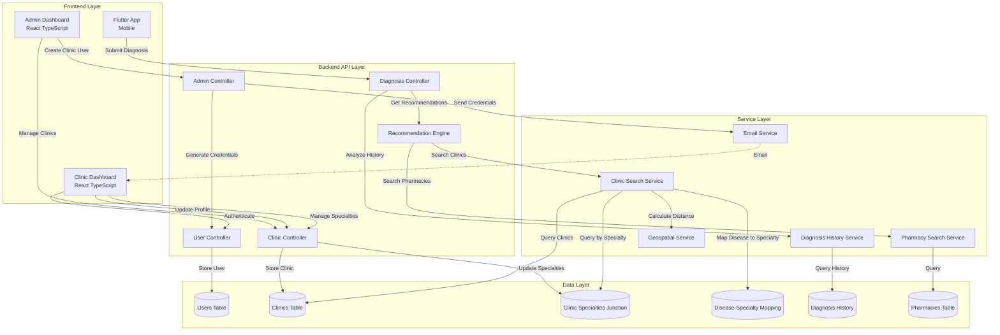

# Design Document: Clinic Specialized Recommendations

## Overview

This feature extends the existing health companion system to include specialized clinic recommendations as an intelligent fallback and proactive care option. When pharmacy-based medication solutions are insufficient (no pharmacy has the required medication) or when a patient exhibits recurring/persistent disease patterns, the system will recommend nearby specialized clinics that can provide advanced medical care.

### Business Context

The current system focuses on medication-based solutions through pharmacy recommendations. However, this approach has limitations:
- Pharmacies may not stock specific medications, leaving patients without options
- Recurring or persistent conditions suggest underlying issues that require more than medication dispensing
- Chronic conditions benefit from specialized clinical management

### Solution Approach

We introduce a new "clinic" user type alongside the existing pharmacy infrastructure. Clinics are:
- Created by administrators through the admin dashboard (similar to pharmacy pattern)
- Associated with medical specialties (e.g., Cardiology, Endocrinology, Infectious Disease)
- Matched to diseases through a disease-to-specialty mapping system
- Searchable by location and specialty
- Accessible through their own dashboard for profile management

The recommendation engine analyzes diagnosis patterns to determine when clinic recommendations should be provided:
1. **Fallback mode**: When no pharmacy has the required medication
2. **Proactive mode**: When recurring/persistent disease patterns are detected
3. **Chronic condition mode**: When diagnosed disease matches patient's chronic conditions

### Key Design Principles

1. **Non-disruptive Integration**: Existing pharmacy recommendation flow remains unchanged
2. **Pattern Matching**: System automatically detects clinical patterns from diagnosis history
3. **Location-based Search**: Uses existing geospatial search patterns (Haversine formula)
4. **Role-based Access**: Clinic users have separate authentication and dashboard
5. **Graceful Degradation**: System continues to function if clinic features are unavailable


## Architecture

### System Components



### Data Flow

#### Clinic User Creation Flow
1. Admin enters clinic information in admin dashboard
2. Backend generates secure credentials (email + temporary password)
3. Backend creates user record with role "clinic"
4. Backend creates clinic profile record
5. Email service sends credentials to clinic email
6. Admin sees confirmation with credentials displayed
7. Clinic receives email with login link and temporary password

#### Clinic Authentication Flow
1. Clinic user logs in with temporary credentials
2. Backend validates credentials and returns auth token
3. Backend includes `mustChangePassword: true` flag
4. Clinic dashboard detects flag and redirects to password change page
5. Clinic user sets new password
6. Backend updates password and sets `mustChangePassword: false`
7. Clinic user gains access to clinic dashboard

#### Clinic Recommendation Flow (No Pharmacy Found)
1. User completes diagnosis in Flutter app
2. Backend searches for pharmacies with required medication
3. No pharmacies found within search radius
4. Backend queries disease-specialty mapping for diagnosed disease
5. Backend searches for clinics matching required specialties
6. Backend calculates distance using Haversine formula
7. Backend returns clinic recommendations with "no_pharmacy_found" reason
8. Flutter app displays "No Nearby Pharmacies Found" message
9. Flutter app displays clinic recommendations section

#### Clinic Recommendation Flow (Recurring Disease)
1. User completes diagnosis in Flutter app
2. Backend queries diagnosis history (past 90 days)
3. Backend detects disease appears 3+ times in history
4. Backend flags as recurring disease
5. Backend searches for both pharmacies and clinics
6. Backend returns both recommendation types with "recurring_disease" reason
7. Flutter app displays clinic recommendations first with "Recurring Condition" badge
8. Flutter app displays pharmacy recommendations below

### Technology Stack

**Frontend:**
- Admin Dashboard: React 18 + TypeScript + Vite + TanStack Query
- Clinic Dashboard: React 18 + TypeScript + Vite + TanStack Query (separate app instance)
- Mobile App: Flutter 3.x + Dart

**Backend:**
- Runtime: Node.js + TypeScript
- Framework: Express.js
- ORM: TypeORM
- Database: PostgreSQL with PostGIS extension for geospatial queries
- Email: Nodemailer with configured SMTP

**Authentication:**
- JWT tokens (access + refresh)
- bcrypt for password hashing (12 rounds)
- Role-based access control (RBAC)


## Components and Interfaces

### Database Schema

#### 1. User Table Extension
```typescript
// Extension to existing User model
export enum UserRole {
    ADMIN = 'admin',
    HEALTH_WORKER = 'health_worker',
    CLINIC_STAFF = 'clinic_staff',
    SUPERVISOR = 'supervisor',
    PHARMACIST = 'pharmacist',
    CLINIC = 'clinic' // NEW ROLE
}

@Entity('users')
export class User {
    // ... existing fields ...
    
    @Column({
        type: 'enum',
        enum: UserRole,
        default: UserRole.HEALTH_WORKER
    })
    role!: UserRole; // Now includes 'clinic' option
    
    @Column({ type: 'boolean', default: true })
    mustChangePassword!: boolean; // Used for temporary passwords
}
```

#### 2. Clinics Table (NEW)
```typescript
@Entity('clinics')
@Index(['managerId'], { unique: true }) // One clinic per clinic user
@Index(['isActive'])
@Index(['latitude', 'longitude']) // Geospatial index
export class Clinic {
    @PrimaryGeneratedColumn('uuid')
    id!: string;

    @Column({ type: 'uuid', unique: true })
    managerId!: string; // References User.id where role='clinic'

    @Column({ type: 'varchar', length: 255 })
    name!: string;

    @Column({ type: 'varchar', length: 255, nullable: true })
    managerName?: string;

    @Column({ type: 'varchar', length: 20, nullable: true })
    phoneNumber?: string;

    @Column({ type: 'varchar', length: 500, nullable: true })
    address?: string;

    @Column({ type: 'decimal', precision: 10, scale: 7 })
    latitude!: number; // -90 to 90

    @Column({ type: 'decimal', precision: 10, scale: 7 })
    longitude!: number; // -180 to 180

    @Column({ type: 'varchar', length: 255, nullable: true })
    city?: string;

    @Column({ type: 'varchar', length: 255, nullable: true })
    district?: string;

    @Column({ type: 'varchar', length: 255, nullable: true })
    country?: string;

    @Column({ type: 'boolean', default: true })
    isActive!: boolean;

    @Column({ type: 'jsonb', nullable: true })
    openingHours?: OperatingHours; // Structured JSON format

    @OneToMany(() => ClinicSpecialty, (cs) => cs.clinic, { cascade: true })
    specialties!: ClinicSpecialty[];

    @CreateDateColumn()
    createdAt!: Date;

    @UpdateDateColumn()
    updatedAt!: Date;
}

interface OperatingHours {
    monday?: { open: string; close: string };
    tuesday?: { open: string; close: string };
    wednesday?: { open: string; close: string };
    thursday?: { open: string; close: string };
    friday?: { open: string; close: string };
    saturday?: { open: string; close: string };
    sunday?: { open: string; close: string };
}
```

#### 3. Clinic Specialties Junction Table (NEW)
```typescript
@Entity('clinic_specialties')
@Index(['clinicId', 'specialty'], { unique: true })
export class ClinicSpecialty {
    @PrimaryGeneratedColumn('uuid')
    id!: string;

    @Column({ type: 'uuid' })
    clinicId!: string;

    @Column({
        type: 'enum',
        enum: MedicalSpecialty
    })
    specialty!: MedicalSpecialty;

    @ManyToOne(() => Clinic, (clinic) => clinic.specialties, { onDelete: 'CASCADE' })
    @JoinColumn({ name: 'clinicId' })
    clinic!: Clinic;

    @CreateDateColumn()
    createdAt!: Date;
}

export enum MedicalSpecialty {
    CARDIOLOGY = 'Cardiology',
    ENDOCRINOLOGY = 'Endocrinology',
    INFECTIOUS_DISEASE = 'Infectious_Disease',
    PULMONOLOGY = 'Pulmonology',
    NEPHROLOGY = 'Nephrology',
    GASTROENTEROLOGY = 'Gastroenterology',
    NEUROLOGY = 'Neurology',
    ONCOLOGY = 'Oncology',
    DERMATOLOGY = 'Dermatology',
    ORTHOPEDICS = 'Orthopedics',
    GENERAL_MEDICINE = 'General_Medicine'
}
```

#### 4. Disease-Specialty Mapping Table (NEW)
```typescript
@Entity('disease_specialty_mappings')
@Index(['diseaseName'])
export class DiseaseSpecialtyMapping {
    @PrimaryGeneratedColumn('uuid')
    id!: string;

    @Column({ type: 'varchar', length: 255 })
    diseaseName!: string; // Normalized disease name

    @Column({
        type: 'enum',
        enum: MedicalSpecialty
    })
    primarySpecialty!: MedicalSpecialty;

    @Column({
        type: 'enum',
        enum: MedicalSpecialty,
        array: true,
        default: []
    })
    secondarySpecialties!: MedicalSpecialty[];

    @Column({ type: 'int', default: 1 })
    priority!: number; // Lower number = higher priority

    @CreateDateColumn()
    createdAt!: Date;

    @UpdateDateColumn()
    updatedAt!: Date;
}
```

#### 5. Analytics Events Table Extension (NEW)
```typescript
@Entity('analytics_events')
@Index(['eventType', 'createdAt'])
export class AnalyticsEvent {
    @PrimaryGeneratedColumn('uuid')
    id!: string;

    @Column({ type: 'varchar', length: 100 })
    eventType!: string; // e.g., 'clinic_recommendation', 'no_pharmacy_fallback'

    @Column({ type: 'uuid', nullable: true })
    patientId?: string;

    @Column({ type: 'uuid', nullable: true })
    diagnosisId?: string;

    @Column({ type: 'varchar', length: 255, nullable: true })
    diseaseName?: string;

    @Column({ type: 'varchar', length: 100, nullable: true })
    reason?: string; // 'no_pharmacy_found', 'recurring_disease', 'persistent_disease'

    @Column({ type: 'int', nullable: true })
    clinicCount?: number;

    @Column({ type: 'jsonb', nullable: true })
    metadata?: Record<string, any>;

    @CreateDateColumn()
    createdAt!: Date;
}
```

### Backend API Endpoints

#### Clinic Management (Admin)

**POST /api/admin/clinics**
- Description: Create new clinic user and profile
- Auth: Admin only
- Request Body:
```typescript
{
  name: string;
  managerName: string;
  email: string;
  phoneNumber: string;
  address: string;
  city: string;
  district: string;
  country: string;
  latitude: number;  // -90 to 90
  longitude: number; // -180 to 180
  openingHours?: OperatingHours;
  specialties: MedicalSpecialty[]; // At least one required
  sendEmail?: boolean; // Default true
}
```
- Response:
```typescript
{
  success: true;
  message: string;
  data: {
    user: {
      id: string;
      email: string;
      role: 'clinic';
      firstName: string;
      lastName: string;
    };
    clinic: {
      id: string;
      name: string;
      managerId: string;
      isActive: boolean;
      specialties: MedicalSpecialty[];
    };
    temporaryPassword: string; // For admin display
    emailSent: boolean;
  };
}
```

**GET /api/admin/clinics**
- Description: List all clinics with filtering and pagination
- Auth: Admin only
- Query Parameters:
  - `page?: number` (default: 1)
  - `limit?: number` (default: 20)
  - `search?: string` (searches name, city, district)
  - `specialty?: MedicalSpecialty`
  - `isActive?: boolean`
- Response:
```typescript
{
  success: true;
  data: {
    clinics: Array<{
      id: string;
      name: string;
      managerName?: string;
      email: string;
      phoneNumber?: string;
      address?: string;
      city?: string;
      district?: string;
      latitude: number;
      longitude: number;
      isActive: boolean;
      specialties: MedicalSpecialty[];
      createdAt: string;
    }>;
    pagination: {
      page: number;
      limit: number;
      total: number;
      totalPages: number;
    };
  };
}
```

**GET /api/admin/clinics/:id**
- Description: Get detailed clinic information
- Auth: Admin only
- Response: Single clinic object with full details

**PUT /api/admin/clinics/:id/status**
- Description: Activate/deactivate clinic
- Auth: Admin only
- Request Body: `{ isActive: boolean }`

#### Clinic Profile Management (Clinic User)

**GET /api/clinic-manager/my**
- Description: Get current clinic user's clinic profile
- Auth: Clinic user only
- Response:
```typescript
{
  success: true;
  data: {
    clinic: {
      id: string;
      name: string;
      managerName?: string;
      phoneNumber?: string;
      address?: string;
      city?: string;
      district?: string;
      country?: string;
      latitude: number;
      longitude: number;
      isActive: boolean;
      openingHours?: OperatingHours;
      specialties: MedicalSpecialty[];
      createdAt: string;
    };
  };
}
```

**POST /api/clinic-manager/register**
- Description: Register clinic profile for authenticated clinic user (first-time setup)
- Auth: Clinic user only
- Request Body: Same as admin create but without email/credentials

**PUT /api/clinic-manager/my/profile**
- Description: Update clinic profile information
- Auth: Clinic user only
- Request Body: Partial clinic profile fields

**PUT /api/clinic-manager/my/specialties**
- Description: Update clinic specialties
- Auth: Clinic user only
- Request Body:
```typescript
{
  specialties: MedicalSpecialty[]; // At least one required
}
```

#### Clinic Search (Public/Internal)

**POST /api/clinics/search**
- Description: Search for specialized clinics by disease and location
- Auth: Authenticated users (internal use by recommendation engine)
- Request Body:
```typescript
{
  diseaseName: string;
  latitude?: number;
  longitude?: number;
  radiusKm?: number; // Default 100
  onlyOpen?: boolean; // Filter by current operating hours
  limit?: number; // Default 10
}
```
- Response:
```typescript
{
  success: true;
  data: {
    clinics: Array<{
      id: string;
      name: string;
      phoneNumber?: string;
      address?: string;
      city?: string;
      district?: string;
      latitude: number;
      longitude: number;
      specialties: MedicalSpecialty[];
      distance?: number; // In kilometers
      isOpenNow: boolean;
      openingHours?: OperatingHours;
    }>;
    mappedSpecialties: MedicalSpecialty[]; // Specialties for this disease
    reason?: string;
  };
}
```

#### Disease-Specialty Mapping (Admin)

**GET /api/admin/disease-mappings**
- Description: List all disease-specialty mappings
- Auth: Admin only

**POST /api/admin/disease-mappings**
- Description: Create new disease-specialty mapping
- Auth: Admin only
- Request Body:
```typescript
{
  diseaseName: string;
  primarySpecialty: MedicalSpecialty;
  secondarySpecialties?: MedicalSpecialty[];
  priority?: number;
}
```

**PUT /api/admin/disease-mappings/:id**
- Description: Update disease-specialty mapping
- Auth: Admin only

**GET /api/disease-mappings/search?disease=:diseaseName**
- Description: Get specialties for a specific disease
- Auth: Authenticated users
- Response:
```typescript
{
  success: true;
  data: {
    diseaseName: string;
    primarySpecialty: MedicalSpecialty;
    secondarySpecialties: MedicalSpecialty[];
    allSpecialties: MedicalSpecialty[]; // Combined array
  };
}
```

#### Diagnosis and Recommendations (Modified)

**POST /api/diagnosis/analyze**
- Description: Existing endpoint extended with clinic recommendation logic
- Response Extension:
```typescript
{
  success: true;
  data: {
    diagnosis: { ... }, // Existing diagnosis data
    recommendations: {
      pharmacies: [...], // Existing pharmacy recommendations
      clinics?: Array<{  // NEW: Clinic recommendations
        id: string;
        name: string;
        specialties: MedicalSpecialty[];
        phoneNumber?: string;
        address?: string;
        city?: string;
        distance?: number;
        isOpenNow: boolean;
        reason: 'no_pharmacy_found' | 'recurring_disease' | 'persistent_disease' | 'chronic_condition';
      }>;
      clinicRecommendationReason?: string; // Human-readable explanation
    };
    patternAnalysis?: { // NEW: Disease pattern information
      isRecurring?: boolean;
      isPersistent?: boolean;
      matchesChronicCondition?: boolean;
      occurrenceCount?: number;
      durationDays?: number;
    };
  };
}
```


### Service Layer Interfaces

#### ClinicSearchService

```typescript
interface ClinicSearchService {
  /**
   * Search for clinics by disease and location
   */
  searchByDisease(params: {
    diseaseName: string;
    latitude?: number;
    longitude?: number;
    radiusKm?: number;
    onlyOpen?: boolean;
    limit?: number;
  }): Promise<ClinicSearchResult>;

  /**
   * Find clinics by specific specialties
   */
  searchBySpecialties(params: {
    specialties: MedicalSpecialty[];
    latitude?: number;
    longitude?: number;
    radiusKm?: number;
    limit?: number;
  }): Promise<Clinic[]>;

  /**
   * Check if clinic is currently open
   */
  isClinicOpen(clinic: Clinic): boolean;

  /**
   * Calculate distance between two coordinates
   */
  calculateDistance(
    lat1: number,
    lon1: number,
    lat2: number,
    lon2: number
  ): number;
}

interface ClinicSearchResult {
  clinics: Array<Clinic & { distance?: number; isOpenNow: boolean }>;
  mappedSpecialties: MedicalSpecialty[];
  totalFound: number;
}
```

**Implementation Notes:**
- Uses Haversine formula for distance calculation
- Queries disease-specialty mapping table first
- Uses geospatial index on clinic coordinates for performance
- Filters by isActive status
- Sorts results by distance ascending
- Timeout: 5 seconds to prevent diagnosis delays

#### DiagnosisHistoryService (Extended)

```typescript
interface DiagnosisHistoryService {
  /**
   * Existing methods remain unchanged
   */
  getDiagnosisHistory(patientId: string, limit?: number): Promise<Diagnosis[]>;

  /**
   * NEW: Detect recurring disease pattern
   */
  detectRecurringDisease(
    patientId: string,
    diseaseName: string
  ): Promise<RecurringDiseaseInfo>;

  /**
   * NEW: Detect persistent disease pattern
   */
  detectPersistentDisease(
    patientId: string,
    diseaseName: string
  ): Promise<PersistentDiseaseInfo>;

  /**
   * NEW: Check if disease matches chronic condition
   */
  matchesChronicCondition(
    patientId: string,
    diseaseName: string
  ): Promise<boolean>;
}

interface RecurringDiseaseInfo {
  isRecurring: boolean;
  occurrenceCount: number;
  timeWindowDays: number; // 90 days
  firstOccurrence?: Date;
  lastOccurrence?: Date;
}

interface PersistentDiseaseInfo {
  isPersistent: boolean;
  durationDays: number;
  firstActiveDiagnosis?: Date;
  status: 'active' | 'ongoing' | 'resolved';
}
```

**Implementation Notes:**
- Recurring detection: Queries past 90 days, counts occurrences ≥ 3
- Persistent detection: Checks for active diagnoses > 30 days old
- Chronic condition matching: Uses fuzzy string matching (80% threshold)
- Excludes resolved diagnoses from pattern detection

#### RecommendationEngine (Extended)

```typescript
interface RecommendationEngine {
  /**
   * Get comprehensive recommendations for a diagnosis
   */
  getRecommendations(params: {
    diagnosisId: string;
    patientId: string;
    diseaseName: string;
    medications: string[];
    latitude?: number;
    longitude?: number;
  }): Promise<RecommendationResult>;

  /**
   * Determine if clinic recommendations should be included
   */
  shouldRecommendClinics(params: {
    hasPharmacyResults: boolean;
    isRecurring: boolean;
    isPersistent: boolean;
    matchesChronicCondition: boolean;
  }): {
    shouldRecommend: boolean;
    reason: RecommendationReason;
    priority: 'high' | 'normal';
  };
}

interface RecommendationResult {
  pharmacies: PharmacyRecommendation[];
  clinics?: ClinicRecommendation[];
  reason?: RecommendationReason;
  patternAnalysis?: PatternAnalysis;
}

type RecommendationReason = 
  | 'no_pharmacy_found'
  | 'recurring_disease'
  | 'persistent_disease'
  | 'chronic_condition';

interface PatternAnalysis {
  isRecurring: boolean;
  isPersistent: boolean;
  matchesChronicCondition: boolean;
  occurrenceCount?: number;
  durationDays?: number;
}
```

**Logic Flow:**
```typescript
async function getRecommendations(params) {
  // 1. Search for pharmacies (existing logic)
  const pharmacies = await pharmacySearchService.search(...);
  
  // 2. Analyze diagnosis patterns
  const recurring = await diagnosisHistoryService.detectRecurringDisease(...);
  const persistent = await diagnosisHistoryService.detectPersistentDisease(...);
  const chronic = await diagnosisHistoryService.matchesChronicCondition(...);
  
  // 3. Determine if clinic recommendations needed
  const { shouldRecommend, reason, priority } = shouldRecommendClinics({
    hasPharmacyResults: pharmacies.length > 0,
    isRecurring: recurring.isRecurring,
    isPersistent: persistent.isPersistent,
    matchesChronicCondition: chronic,
  });
  
  // 4. Search for clinics if needed
  let clinics = [];
  if (shouldRecommend) {
    try {
      const result = await clinicSearchService.searchByDisease(...);
      clinics = result.clinics;
      
      // Log analytics
      await analyticsService.logEvent({
        eventType: 'clinic_recommendation',
        reason,
        clinicCount: clinics.length,
        ...
      });
    } catch (error) {
      // Graceful degradation: log error but don't fail diagnosis
      logger.error('Clinic search failed', error);
    }
  }
  
  return {
    pharmacies,
    clinics: shouldRecommend ? clinics : undefined,
    reason,
    patternAnalysis: {
      isRecurring: recurring.isRecurring,
      isPersistent: persistent.isPersistent,
      matchesChronicCondition: chronic,
      occurrenceCount: recurring.occurrenceCount,
      durationDays: persistent.durationDays,
    },
  };
}

function shouldRecommendClinics(params) {
  // Proactive mode: Recurring disease
  if (params.isRecurring) {
    return {
      shouldRecommend: true,
      reason: 'recurring_disease',
      priority: 'high',
    };
  }
  
  // Proactive mode: Persistent disease
  if (params.isPersistent) {
    return {
      shouldRecommend: true,
      reason: 'persistent_disease',
      priority: 'high',
    };
  }
  
  // Proactive mode: Chronic condition
  if (params.matchesChronicCondition) {
    return {
      shouldRecommend: true,
      reason: 'chronic_condition',
      priority: 'high',
    };
  }
  
  // Fallback mode: No pharmacy found
  if (!params.hasPharmacyResults) {
    return {
      shouldRecommend: true,
      reason: 'no_pharmacy_found',
      priority: 'normal',
    };
  }
  
  // No clinic recommendations needed
  return {
    shouldRecommend: false,
    reason: undefined,
    priority: 'normal',
  };
}
```

#### EmailService (Extended)

```typescript
interface EmailService {
  /**
   * Existing methods
   */
  sendWelcomeEmail(params: WelcomeEmailParams): Promise<boolean>;

  /**
   * NEW: Send clinic credentials email
   */
  sendClinicCredentialsEmail(params: {
    email: string;
    clinicName: string;
    temporaryPassword: string;
    loginUrl: string;
  }): Promise<boolean>;
}
```

**Email Template (Clinic Credentials):**
```
Subject: Your Clinic Portal Access - [Clinic Name]

Dear [Clinic Name] Team,

Welcome to the AI Health Companion Clinic Portal!

Your clinic has been registered in our system. Please use the following credentials to access your clinic dashboard:

Login URL: [Dashboard URL]
Email: [email]
Temporary Password: [temporaryPassword]

IMPORTANT: For security reasons, you will be required to change your password on first login.

From your clinic dashboard, you can:
- Update your clinic profile and contact information
- Manage your medical specialties
- View clinic recommendations sent to patients
- Update your operating hours

If you have any questions or need assistance, please contact our support team at [support email].

Thank you for being part of our healthcare network!

Best regards,
AI Health Companion Team
```

### Frontend Component Structure

#### Admin Dashboard - Clinics Page

**Component Hierarchy:**
```
Clinics (Page)
├── ClinicsHeader
├── ClinicsSearchBar
├── ClinicsTable
│   ├── ClinicRow (repeated)
│   │   ├── ClinicInfoCell
│   │   ├── ClinicLocationCell
│   │   ├── ClinicSpecialtiesCell
│   │   ├── ClinicStatusCell
│   │   └── ClinicActionsCell
│   └── Pagination
├── CreateClinicModal
│   ├── ClinicBasicInfoForm
│   ├── ClinicLocationForm
│   ├── ClinicSpecialtiesSelector
│   └── ClinicOperatingHoursForm
└── ClinicDetailsModal
    ├── ClinicBasicInfo
    ├── ClinicLocation
    ├── ClinicSpecialtiesList
    └── ClinicOperatingHoursList
```

**Key Components:**

`CreateClinicModal.tsx`:
```typescript
interface CreateClinicFormData {
  name: string;
  managerName: string;
  email: string;
  phoneNumber: string;
  address: string;
  city: string;
  district: string;
  country: string;
  latitude: number;
  longitude: number;
  specialties: MedicalSpecialty[];
  openingHours?: OperatingHours;
  sendEmail: boolean;
}

// Validation schema
const createClinicSchema = z.object({
  name: z.string().min(3, 'Clinic name must be at least 3 characters'),
  managerName: z.string().min(2, 'Manager name is required'),
  email: z.string().email('Invalid email address'),
  phoneNumber: z.string().min(10, 'Valid phone number required'),
  address: z.string().min(5, 'Address is required'),
  city: z.string().min(2, 'City is required'),
  district: z.string().optional(),
  country: z.string().min(2, 'Country is required'),
  latitude: z.number().min(-90).max(90, 'Latitude must be between -90 and 90'),
  longitude: z.number().min(-180).max(180, 'Longitude must be between -180 and 180'),
  specialties: z.array(z.nativeEnum(MedicalSpecialty)).min(1, 'Select at least one specialty'),
  sendEmail: z.boolean().default(true),
});
```

#### Clinic Dashboard Application

**New React Application Structure:**
```
src/
├── main.tsx                      # Entry point
├── App.tsx                       # Main app with routing
├── components/
│   ├── layout/
│   │   ├── ClinicLayout.tsx      # Main layout with sidebar
│   │   ├── ClinicSidebar.tsx     # Navigation sidebar
│   │   └── ClinicHeader.tsx      # Top header bar
│   └── ui/                       # Shared UI components (reuse from admin)
├── contexts/
│   └── ClinicAuthContext.tsx     # Clinic-specific auth context
├── lib/
│   ├── api.ts                    # API client
│   └── utils.ts                  # Utility functions
├── pages/
│   ├── ClinicLogin.tsx           # Login page
│   ├── ClinicChangePassword.tsx  # Password change (first time & regular)
│   ├── ClinicDashboard.tsx       # Main dashboard
│   ├── ClinicProfile.tsx         # Profile management
│   └── ClinicSpecialties.tsx     # Specialties management
└── types/
    └── index.ts                  # TypeScript definitions
```

**Theme Colors (Clinic Dashboard):**
- Primary: Blue (#3B82F6)
- Secondary: Indigo (#6366F1)
- Success: Green (#10B981)
- Warning: Amber (#F59E0B)
- Danger: Red (#EF4444)

**Differentiates from Pharmacy Dashboard:**
- Pharmacy: Teal (#14B8A6) and Orange (#F97316)
- Clinic: Blue (#3B82F6) and Indigo (#6366F1)

#### Flutter App - Clinic Recommendation UI

**New Components:**

`ClinicRecommendationCard.dart`:
```dart
class ClinicRecommendationCard extends StatelessWidget {
  final ClinicRecommendation clinic;
  final String reason;

  Widget build(BuildContext context) {
    return Card(
      margin: EdgeInsets.symmetric(horizontal: 16, vertical: 8),
      elevation: 2,
      shape: RoundedRectangleBorder(
        borderRadius: BorderRadius.circular(12),
        side: BorderSide(color: Colors.blue.shade200),
      ),
      child: InkWell(
        onTap: () => _showClinicDetails(context),
        borderRadius: BorderRadius.circular(12),
        child: Padding(
          padding: EdgeInsets.all(16),
          child: Column(
            crossAxisAlignment: CrossAxisAlignment.start,
            children: [
              // Clinic name and specialties
              Row(
                children: [
                  Icon(Icons.local_hospital, color: Colors.blue),
                  SizedBox(width: 8),
                  Expanded(
                    child: Text(
                      clinic.name,
                      style: Theme.of(context).textTheme.titleMedium?.copyWith(
                        fontWeight: FontWeight.bold,
                      ),
                    ),
                  ),
                  _buildReasonBadge(reason),
                ],
              ),
              SizedBox(height: 8),
              
              // Specialties chips
              Wrap(
                spacing: 4,
                runSpacing: 4,
                children: clinic.specialties.map((specialty) =>
                  Chip(
                    label: Text(specialty, style: TextStyle(fontSize: 11)),
                    backgroundColor: Colors.blue.shade50,
                    padding: EdgeInsets.zero,
                    materialTapTargetSize: MaterialTapTargetSize.shrinkWrap,
                  ),
                ).toList(),
              ),
              
              SizedBox(height: 12),
              
              // Location and distance
              Row(
                children: [
                  Icon(Icons.location_on, size: 16, color: Colors.grey[600]),
                  SizedBox(width: 4),
                  Expanded(
                    child: Text(
                      '${clinic.city ?? ''}, ${clinic.district ?? ''}',
                      style: TextStyle(fontSize: 13, color: Colors.grey[700]),
                    ),
                  ),
                  if (clinic.distance != null)
                    Text(
                      '${clinic.distance!.toStringAsFixed(1)} km',
                      style: TextStyle(
                        fontSize: 13,
                        fontWeight: FontWeight.w500,
                        color: Colors.blue,
                      ),
                    ),
                ],
              ),
              
              SizedBox(height: 12),
              
              // Action buttons
              Row(
                children: [
                  Expanded(
                    child: ElevatedButton.icon(
                      onPressed: () => _makePhoneCall(clinic.phoneNumber),
                      icon: Icon(Icons.phone, size: 18),
                      label: Text('Call'),
                      style: ElevatedButton.styleFrom(
                        backgroundColor: Colors.blue,
                        padding: EdgeInsets.symmetric(vertical: 12),
                      ),
                    ),
                  ),
                  SizedBox(width: 8),
                  Expanded(
                    child: OutlinedButton.icon(
                      onPressed: () => _openInMaps(clinic.latitude, clinic.longitude),
                      icon: Icon(Icons.map, size: 18),
                      label: Text('Navigate'),
                      style: OutlinedButton.styleFrom(
                        padding: EdgeInsets.symmetric(vertical: 12),
                      ),
                    ),
                  ),
                ],
              ),
            ],
          ),
        ),
      ),
    );
  }

  Widget _buildReasonBadge(String reason) {
    String label;
    Color color;
    
    switch (reason) {
      case 'recurring_disease':
        label = 'Recurring';
        color = Colors.orange;
        break;
      case 'persistent_disease':
        label = 'Persistent';
        color = Colors.amber;
        break;
      case 'chronic_condition':
        label = 'Chronic';
        color = Colors.red;
        break;
      default:
        label = 'Specialist Care';
        color = Colors.blue;
    }
    
    return Container(
      padding: EdgeInsets.symmetric(horizontal: 8, vertical: 4),
      decoration: BoxDecoration(
        color: color.withOpacity(0.1),
        borderRadius: BorderRadius.circular(12),
        border: Border.all(color: color.withOpacity(0.3)),
      ),
      child: Text(
        label,
        style: TextStyle(
          fontSize: 11,
          fontWeight: FontWeight.w600,
          color: color.shade700,
        ),
      ),
    );
  }
}
```

**Integration with DiagnosisResultPage:**

```dart
class DiagnosisResultPage extends StatelessWidget {
  Widget build(BuildContext context) {
    return SingleChildScrollView(
      child: Column(
        children: [
          // Existing diagnosis information
          DiagnosisInfoCard(...),
          
          // NEW: Pattern analysis notice (if applicable)
          if (diagnosisResult.patternAnalysis?.isRecurring == true ||
              diagnosisResult.patternAnalysis?.isPersistent == true)
            PatternAnalysisNotice(
              analysis: diagnosisResult.patternAnalysis!,
            ),
          
          // NEW: Clinic recommendations (if provided)
          if (diagnosisResult.recommendations.clinics != null &&
              diagnosisResult.recommendations.clinics!.isNotEmpty)
            Column(
              crossAxisAlignment: CrossAxisAlignment.start,
              children: [
                _buildSectionHeader(
                  'Specialized Clinic Recommendations',
                  Icons.local_hospital,
                  Colors.blue,
                ),
                _buildRecommendationExplanation(
                  diagnosisResult.recommendations.clinicRecommendationReason!,
                ),
                ...diagnosisResult.recommendations.clinics!.map((clinic) =>
                  ClinicRecommendationCard(
                    clinic: clinic,
                    reason: diagnosisResult.recommendations.clinicRecommendationReason!,
                  ),
                ),
              ],
            ),
          
          // Existing pharmacy recommendations
          if (diagnosisResult.recommendations.pharmacies.isNotEmpty)
            Column(
              crossAxisAlignment: CrossAxisAlignment.start,
              children: [
                _buildSectionHeader(
                  'Nearby Pharmacies',
                  Icons.medication,
                  Colors.orange,
                ),
                ...diagnosisResult.recommendations.pharmacies.map((pharmacy) =>
                  PharmacyRecommendationCard(pharmacy: pharmacy),
                ),
              ],
            )
          else if (diagnosisResult.recommendations.clinics == null ||
                   diagnosisResult.recommendations.clinics!.isEmpty)
            NoRecommendationsCard(),
        ],
      ),
    );
  }

  Widget _buildRecommendationExplanation(String reason) {
    String text;
    Icon icon;
    Color color;
    
    switch (reason) {
      case 'recurring_disease':
        text = 'This condition has been diagnosed multiple times recently. '
               'Specialized clinic care may help address the underlying cause.';
        icon = Icon(Icons.refresh, color: Colors.orange);
        color = Colors.orange.shade50;
        break;
      case 'persistent_disease':
        text = 'This condition has been ongoing for an extended period. '
               'Specialized treatment may provide better outcomes.';
        icon = Icon(Icons.access_time, color: Colors.amber.shade700);
        color = Colors.amber.shade50;
        break;
      case 'chronic_condition':
        text = 'This matches your chronic health condition. '
               'Regular specialized care is recommended.';
        icon = Icon(Icons.healing, color: Colors.red);
        color = Colors.red.shade50;
        break;
      case 'no_pharmacy_found':
        text = 'No nearby pharmacies have the required medication. '
               'These specialized clinics can provide alternative treatment.';
        icon = Icon(Icons.info_outline, color: Colors.blue);
        color = Colors.blue.shade50;
        break;
      default:
        text = 'Specialized clinic care may benefit your condition.';
        icon = Icon(Icons.info_outline, color: Colors.blue);
        color = Colors.blue.shade50;
    }
    
    return Container(
      margin: EdgeInsets.symmetric(horizontal: 16, vertical: 8),
      padding: EdgeInsets.all(16),
      decoration: BoxDecoration(
        color: color,
        borderRadius: BorderRadius.circular(12),
        border: Border.all(color: color),
      ),
      child: Row(
        crossAxisAlignment: CrossAxisAlignment.start,
        children: [
          icon,
          SizedBox(width: 12),
          Expanded(
            child: Text(
              text,
              style: TextStyle(fontSize: 14, color: Colors.grey[800]),
            ),
          ),
        ],
      ),
    );
  }
}
```


## Data Models

### TypeScript/TypeORM Models

#### Clinic Model
```typescript
import { Entity, PrimaryGeneratedColumn, Column, CreateDateColumn, UpdateDateColumn, Index, OneToMany, JoinColumn } from 'typeorm';

export enum MedicalSpecialty {
    CARDIOLOGY = 'Cardiology',
    ENDOCRINOLOGY = 'Endocrinology',
    INFECTIOUS_DISEASE = 'Infectious_Disease',
    PULMONOLOGY = 'Pulmonology',
    NEPHROLOGY = 'Nephrology',
    GASTROENTEROLOGY = 'Gastroenterology',
    NEUROLOGY = 'Neurology',
    ONCOLOGY = 'Oncology',
    DERMATOLOGY = 'Dermatology',
    ORTHOPEDICS = 'Orthopedics',
    GENERAL_MEDICINE = 'General_Medicine'
}

export interface OperatingHours {
    monday?: { open: string; close: string };
    tuesday?: { open: string; close: string };
    wednesday?: { open: string; close: string };
    thursday?: { open: string; close: string };
    friday?: { open: string; close: string };
    saturday?: { open: string; close: string };
    sunday?: { open: string; close: string };
}

@Entity('clinics')
@Index(['managerId'], { unique: true })
@Index(['isActive'])
@Index(['latitude', 'longitude']) // For geospatial queries
export class Clinic {
    @PrimaryGeneratedColumn('uuid')
    id!: string;

    @Column({ type: 'uuid', unique: true })
    managerId!: string;

    @Column({ type: 'varchar', length: 255 })
    name!: string;

    @Column({ type: 'varchar', length: 255, nullable: true })
    managerName?: string;

    @Column({ type: 'varchar', length: 20, nullable: true })
    phoneNumber?: string;

    @Column({ type: 'varchar', length: 500, nullable: true })
    address?: string;

    @Column({ type: 'decimal', precision: 10, scale: 7 })
    latitude!: number;

    @Column({ type: 'decimal', precision: 10, scale: 7 })
    longitude!: number;

    @Column({ type: 'varchar', length: 255, nullable: true })
    city?: string;

    @Column({ type: 'varchar', length: 255, nullable: true })
    district?: string;

    @Column({ type: 'varchar', length: 255, nullable: true })
    country?: string;

    @Column({ type: 'boolean', default: true })
    isActive!: boolean;

    @Column({ type: 'jsonb', nullable: true })
    openingHours?: OperatingHours;

    @OneToMany(() => ClinicSpecialty, (cs) => cs.clinic, { cascade: true, eager: true })
    specialties!: ClinicSpecialty[];

    @CreateDateColumn()
    createdAt!: Date;

    @UpdateDateColumn()
    updatedAt!: Date;

    // Helper method to check if clinic is open at a given time
    isOpenAt(date: Date): boolean {
        if (!this.openingHours) return false;
        
        const days = ['sunday', 'monday', 'tuesday', 'wednesday', 'thursday', 'friday', 'saturday'];
        const dayName = days[date.getDay()] as keyof OperatingHours;
        const hours = this.openingHours[dayName];
        
        if (!hours) return false;
        
        const currentTime = date.getHours() * 60 + date.getMinutes();
        const [openHour, openMin] = hours.open.split(':').map(Number);
        const [closeHour, closeMin] = hours.close.split(':').map(Number);
        const openTime = openHour * 60 + openMin;
        const closeTime = closeHour * 60 + closeMin;
        
        return currentTime >= openTime && currentTime < closeTime;
    }

    // Transform to JSON with computed fields
    toJSON() {
        return {
            ...this,
            specialties: this.specialties?.map(s => s.specialty) || [],
            isOpenNow: this.isOpenAt(new Date()),
        };
    }
}
```

#### ClinicSpecialty Model
```typescript
import { Entity, PrimaryGeneratedColumn, Column, CreateDateColumn, ManyToOne, JoinColumn, Index } from 'typeorm';
import { Clinic } from './Clinic';

@Entity('clinic_specialties')
@Index(['clinicId', 'specialty'], { unique: true })
export class ClinicSpecialty {
    @PrimaryGeneratedColumn('uuid')
    id!: string;

    @Column({ type: 'uuid' })
    clinicId!: string;

    @Column({
        type: 'enum',
        enum: MedicalSpecialty
    })
    specialty!: MedicalSpecialty;

    @ManyToOne(() => Clinic, (clinic) => clinic.specialties, { onDelete: 'CASCADE' })
    @JoinColumn({ name: 'clinicId' })
    clinic!: Clinic;

    @CreateDateColumn()
    createdAt!: Date;
}
```

#### DiseaseSpecialtyMapping Model
```typescript
import { Entity, PrimaryGeneratedColumn, Column, CreateDateColumn, UpdateDateColumn, Index } from 'typeorm';
import { MedicalSpecialty } from './Clinic';

@Entity('disease_specialty_mappings')
@Index(['diseaseName'])
export class DiseaseSpecialtyMapping {
    @PrimaryGeneratedColumn('uuid')
    id!: string;

    @Column({ type: 'varchar', length: 255 })
    diseaseName!: string;

    @Column({
        type: 'enum',
        enum: MedicalSpecialty
    })
    primarySpecialty!: MedicalSpecialty;

    @Column({
        type: 'enum',
        enum: MedicalSpecialty,
        array: true,
        default: []
    })
    secondarySpecialties!: MedicalSpecialty[];

    @Column({ type: 'int', default: 1 })
    priority!: number;

    @CreateDateColumn()
    createdAt!: Date;

    @UpdateDateColumn()
    updatedAt!: Date;

    // Helper method to get all specialties
    getAllSpecialties(): MedicalSpecialty[] {
        return [this.primarySpecialty, ...this.secondarySpecialties];
    }
}
```

#### AnalyticsEvent Model
```typescript
import { Entity, PrimaryGeneratedColumn, Column, CreateDateColumn, Index } from 'typeorm';

@Entity('analytics_events')
@Index(['eventType', 'createdAt'])
export class AnalyticsEvent {
    @PrimaryGeneratedColumn('uuid')
    id!: string;

    @Column({ type: 'varchar', length: 100 })
    eventType!: string;

    @Column({ type: 'uuid', nullable: true })
    patientId?: string;

    @Column({ type: 'uuid', nullable: true })
    diagnosisId?: string;

    @Column({ type: 'varchar', length: 255, nullable: true })
    diseaseName?: string;

    @Column({ type: 'varchar', length: 100, nullable: true })
    reason?: string;

    @Column({ type: 'int', nullable: true })
    clinicCount?: number;

    @Column({ type: 'jsonb', nullable: true })
    metadata?: Record<string, any>;

    @CreateDateColumn()
    createdAt!: Date;
}
```

### Flutter/Dart Models

#### ClinicRecommendation Model
```dart
class ClinicRecommendation {
  final String id;
  final String name;
  final List<String> specialties;
  final String? phoneNumber;
  final String? address;
  final String? city;
  final String? district;
  final double latitude;
  final double longitude;
  final double? distance;
  final bool isOpenNow;
  final Map<String, dynamic>? openingHours;
  final String reason;

  ClinicRecommendation({
    required this.id,
    required this.name,
    required this.specialties,
    this.phoneNumber,
    this.address,
    this.city,
    this.district,
    required this.latitude,
    required this.longitude,
    this.distance,
    required this.isOpenNow,
    this.openingHours,
    required this.reason,
  });

  factory ClinicRecommendation.fromJson(Map<String, dynamic> json) {
    return ClinicRecommendation(
      id: json['id'] as String,
      name: json['name'] as String,
      specialties: (json['specialties'] as List<dynamic>)
          .map((e) => e as String)
          .toList(),
      phoneNumber: json['phoneNumber'] as String?,
      address: json['address'] as String?,
      city: json['city'] as String?,
      district: json['district'] as String?,
      latitude: (json['latitude'] as num).toDouble(),
      longitude: (json['longitude'] as num).toDouble(),
      distance: json['distance'] != null 
          ? (json['distance'] as num).toDouble() 
          : null,
      isOpenNow: json['isOpenNow'] as bool? ?? false,
      openingHours: json['openingHours'] as Map<String, dynamic>?,
      reason: json['reason'] as String? ?? 'specialist_care',
    );
  }

  Map<String, dynamic> toJson() {
    return {
      'id': id,
      'name': name,
      'specialties': specialties,
      'phoneNumber': phoneNumber,
      'address': address,
      'city': city,
      'district': district,
      'latitude': latitude,
      'longitude': longitude,
      'distance': distance,
      'isOpenNow': isOpenNow,
      'openingHours': openingHours,
      'reason': reason,
    };
  }

  String get fullAddress {
    final parts = [address, city, district].where((p) => p != null && p.isNotEmpty);
    return parts.join(', ');
  }

  String get distanceText {
    if (distance == null) return 'Distance unavailable';
    if (distance! < 1) return '${(distance! * 1000).toInt()} m away';
    return '${distance!.toStringAsFixed(1)} km away';
  }
}
```

#### PatternAnalysis Model
```dart
class PatternAnalysis {
  final bool isRecurring;
  final bool isPersistent;
  final bool matchesChronicCondition;
  final int? occurrenceCount;
  final int? durationDays;

  PatternAnalysis({
    required this.isRecurring,
    required this.isPersistent,
    required this.matchesChronicCondition,
    this.occurrenceCount,
    this.durationDays,
  });

  factory PatternAnalysis.fromJson(Map<String, dynamic> json) {
    return PatternAnalysis(
      isRecurring: json['isRecurring'] as bool? ?? false,
      isPersistent: json['isPersistent'] as bool? ?? false,
      matchesChronicCondition: json['matchesChronicCondition'] as bool? ?? false,
      occurrenceCount: json['occurrenceCount'] as int?,
      durationDays: json['durationDays'] as int?,
    );
  }

  bool get hasPattern => isRecurring || isPersistent || matchesChronicCondition;

  String get patternDescription {
    if (isRecurring && occurrenceCount != null) {
      return 'Diagnosed $occurrenceCount times in the past 90 days';
    }
    if (isPersistent && durationDays != null) {
      return 'Active for $durationDays days';
    }
    if (matchesChronicCondition) {
      return 'Matches your chronic health condition';
    }
    return '';
  }
}
```

### Database Migration Scripts

#### Create Clinics Table
```sql
CREATE TABLE IF NOT EXISTS clinics (
    id UUID PRIMARY KEY DEFAULT uuid_generate_v4(),
    manager_id UUID NOT NULL UNIQUE,
    name VARCHAR(255) NOT NULL,
    manager_name VARCHAR(255),
    phone_number VARCHAR(20),
    address VARCHAR(500),
    latitude DECIMAL(10, 7) NOT NULL,
    longitude DECIMAL(10, 7) NOT NULL,
    city VARCHAR(255),
    district VARCHAR(255),
    country VARCHAR(255),
    is_active BOOLEAN DEFAULT TRUE,
    opening_hours JSONB,
    created_at TIMESTAMP DEFAULT CURRENT_TIMESTAMP,
    updated_at TIMESTAMP DEFAULT CURRENT_TIMESTAMP,
    CONSTRAINT fk_manager FOREIGN KEY (manager_id) REFERENCES users(id) ON DELETE CASCADE,
    CONSTRAINT check_latitude CHECK (latitude >= -90 AND latitude <= 90),
    CONSTRAINT check_longitude CHECK (longitude >= -180 AND longitude <= 180)
);

CREATE INDEX idx_clinics_manager_id ON clinics(manager_id);
CREATE INDEX idx_clinics_is_active ON clinics(is_active);
CREATE INDEX idx_clinics_location ON clinics(latitude, longitude);
```

#### Create Clinic Specialties Table
```sql
CREATE TYPE medical_specialty AS ENUM (
    'Cardiology',
    'Endocrinology',
    'Infectious_Disease',
    'Pulmonology',
    'Nephrology',
    'Gastroenterology',
    'Neurology',
    'Oncology',
    'Dermatology',
    'Orthopedics',
    'General_Medicine'
);

CREATE TABLE IF NOT EXISTS clinic_specialties (
    id UUID PRIMARY KEY DEFAULT uuid_generate_v4(),
    clinic_id UUID NOT NULL,
    specialty medical_specialty NOT NULL,
    created_at TIMESTAMP DEFAULT CURRENT_TIMESTAMP,
    CONSTRAINT fk_clinic FOREIGN KEY (clinic_id) REFERENCES clinics(id) ON DELETE CASCADE,
    CONSTRAINT unique_clinic_specialty UNIQUE (clinic_id, specialty)
);

CREATE INDEX idx_clinic_specialties_clinic_id ON clinic_specialties(clinic_id);
CREATE INDEX idx_clinic_specialties_specialty ON clinic_specialties(specialty);
```

#### Create Disease-Specialty Mappings Table
```sql
CREATE TABLE IF NOT EXISTS disease_specialty_mappings (
    id UUID PRIMARY KEY DEFAULT uuid_generate_v4(),
    disease_name VARCHAR(255) NOT NULL,
    primary_specialty medical_specialty NOT NULL,
    secondary_specialties medical_specialty[] DEFAULT '{}',
    priority INT DEFAULT 1,
    created_at TIMESTAMP DEFAULT CURRENT_TIMESTAMP,
    updated_at TIMESTAMP DEFAULT CURRENT_TIMESTAMP
);

CREATE INDEX idx_disease_specialty_mappings_disease_name ON disease_specialty_mappings(disease_name);
```

#### Create Analytics Events Table
```sql
CREATE TABLE IF NOT EXISTS analytics_events (
    id UUID PRIMARY KEY DEFAULT uuid_generate_v4(),
    event_type VARCHAR(100) NOT NULL,
    patient_id UUID,
    diagnosis_id UUID,
    disease_name VARCHAR(255),
    reason VARCHAR(100),
    clinic_count INT,
    metadata JSONB,
    created_at TIMESTAMP DEFAULT CURRENT_TIMESTAMP
);

CREATE INDEX idx_analytics_events_type_date ON analytics_events(event_type, created_at);
CREATE INDEX idx_analytics_events_patient_id ON analytics_events(patient_id);
```

#### Seed Disease-Specialty Mappings
```sql
INSERT INTO disease_specialty_mappings (disease_name, primary_specialty, secondary_specialties, priority) VALUES
    ('Diabetes', 'Endocrinology', ARRAY['General_Medicine'], 1),
    ('Hypertension', 'Cardiology', ARRAY['General_Medicine'], 1),
    ('Heart Disease', 'Cardiology', ARRAY['General_Medicine'], 1),
    ('Malaria', 'Infectious_Disease', ARRAY['General_Medicine'], 1),
    ('Tuberculosis', 'Pulmonology', ARRAY['Infectious_Disease', 'General_Medicine'], 1),
    ('Pneumonia', 'Pulmonology', ARRAY['Infectious_Disease', 'General_Medicine'], 1),
    ('Asthma', 'Pulmonology', ARRAY['General_Medicine'], 1),
    ('Kidney Disease', 'Nephrology', ARRAY['General_Medicine'], 1),
    ('Gastritis', 'Gastroenterology', ARRAY['General_Medicine'], 1),
    ('Stroke', 'Neurology', ARRAY['Cardiology', 'General_Medicine'], 1),
    ('Epilepsy', 'Neurology', ARRAY['General_Medicine'], 1),
    ('Cancer', 'Oncology', ARRAY['General_Medicine'], 1),
    ('Skin Infection', 'Dermatology', ARRAY['Infectious_Disease', 'General_Medicine'], 2),
    ('Fracture', 'Orthopedics', ARRAY['General_Medicine'], 1),
    ('Arthritis', 'Orthopedics', ARRAY['General_Medicine'], 2)
ON CONFLICT DO NOTHING;
```


## Correctness Properties

*A property is a characteristic or behavior that should hold true across all valid executions of a system—essentially, a formal statement about what the system should do. Properties serve as the bridge between human-readable specifications and machine-verifiable correctness guarantees.*

### Property Reflection

After analyzing the acceptance criteria, I identified the following testable properties. During reflection, I found several areas where properties could be combined:

**Redundancies Eliminated:**
- Properties 1.3 (credential generation) and 2.8 (credentials in response) → Combined into Property 1 (credential generation completeness)
- Properties 4.2 (temp credential auth) and 1.7 (clinic user auth) → Combined into Property 2 (authentication correctness)
- Properties 9.3 (recurring detection) and 14.1 (recurring triggers clinic search) → Kept separate as they test different layers (detection vs. engine behavior)
- Properties 12.5 (distance filtering) and 12.6 (distance sorting) → Combined into Property 8 (clinic search returns properly filtered and sorted results)
- Properties 13.1, 14.1, 15.1 (various triggers for clinic search) → Combined into Property 10 (recommendation engine decision logic)

### Property 1: Clinic Creation Completeness

*For any* valid clinic creation request, the system SHALL create a user account with role "clinic", generate secure credentials (email and temporary password), create a clinic profile with all provided information, and return both user and clinic data with credentials to the admin.

**Validates: Requirements 1.3, 1.4, 1.6, 2.8**

### Property 2: Clinic User Authentication

*For any* clinic user with valid credentials (temporary or permanent), authentication SHALL succeed and return a valid JWT session token with appropriate role claims, and SHALL fail for invalid credentials.

**Validates: Requirements 1.7, 4.2**

### Property 3: Geographic Coordinate Validation

*For any* clinic creation or update request, the system SHALL accept latitude values between -90 and 90 (inclusive) and longitude values between -180 and 180 (inclusive), and SHALL reject coordinates outside these ranges.

**Validates: Requirements 1.5**

### Property 4: Password Security Requirements

*For any* password change request, the system SHALL validate that the new password meets security requirements (minimum 8 characters), accept passwords meeting requirements, reject passwords failing requirements, and upon successful change SHALL set mustChangePassword to false.

**Validates: Requirements 4.6, 4.7, 5.5**

### Property 5: Clinic Specialty Validation

*For any* specialty update request, the system SHALL validate that all specified specialties exist in the predefined MedicalSpecialty enum, SHALL require at least one specialty, and SHALL reject empty specialty arrays or invalid specialty names.

**Validates: Requirements 7.4, 7.7**

### Property 6: Disease-Specialty Mapping Query

*For any* disease name (whether mapped or unmapped), the system SHALL return a list of relevant medical specialties, defaulting to General_Medicine when no explicit mapping exists.

**Validates: Requirements 8.5, 8.6**

### Property 7: Recurring Disease Detection

*For any* patient diagnosis history, when the same disease appears 3 or more times within a 90-day window (excluding resolved diagnoses), the system SHALL flag it as a recurring disease and include the occurrence count.

**Validates: Requirements 9.2, 9.3, 9.4**

### Property 8: Persistent Disease Detection

*For any* patient diagnosis history, when the same disease has at least one active or ongoing diagnosis dated more than 30 days ago, the system SHALL flag it as a persistent disease and calculate the duration in days.

**Validates: Requirements 10.3, 10.4**

### Property 9: Chronic Condition Matching

*For any* diagnosed disease and patient chronic condition list, when a chronic condition name matches the disease name with at least 80% similarity (using fuzzy string matching), the system SHALL flag the diagnosis as matching a chronic condition.

**Validates: Requirements 11.4**

### Property 10: Clinic Search Distance Calculation and Filtering

*For any* clinic search with patient location coordinates, the system SHALL calculate distances using the Haversine formula, filter results to include only clinics within the specified radius (default 100km), and sort results by distance in ascending order.

**Validates: Requirements 12.4, 12.5, 12.6**

### Property 11: Recommendation Engine Decision Logic

*For any* diagnosis with pattern analysis (recurring, persistent, or chronic condition match), the Recommendation_Engine SHALL invoke the Clinic_Search_Service and include clinic recommendations in the response. When the Pharmacy_Search_Service returns zero results, the Recommendation_Engine SHALL invoke the Clinic_Search_Service as a fallback.

**Validates: Requirements 13.1, 14.1, 15.1**

### Property 12: Operating Hours Time Validation

*For any* clinic with structured operating hours and any given date-time, the system SHALL correctly determine whether the clinic is currently open by comparing the time against the operating hours for the corresponding day of the week.

**Validates: Requirements 20.2**

### Property 13: Graceful Degradation on Clinic Search Failure

*For any* diagnosis workflow, even when the Clinic_Search_Service fails (due to mapping query failure, timeout, or other errors), the diagnosis workflow SHALL complete successfully, optionally fall back to General_Medicine clinics, and not expose errors to the client.

**Validates: Requirements 24.2, 24.4, 24.7**

### Property 14: Email Failure Resilience

*For any* clinic creation request, even when the email service fails to send credentials, the clinic user account and profile SHALL still be created successfully, and an error SHALL be logged.

**Validates: Requirements 3.5**

### Property 15: Conditional Response Structure

*For any* diagnosis result, the API response SHALL include the "clinicRecommendations" field only when clinic recommendations were generated, and SHALL include "patternAnalysis" only when pattern detection was performed, ensuring clients can safely check for field presence.

**Validates: Requirements 26.4**


## Error Handling

### Error Categories and Responses

#### 1. Validation Errors (400 Bad Request)

**Scenarios:**
- Invalid email format
- Coordinates out of range (lat not in [-90, 90] or lon not in [-180, 180])
- Missing required fields (name, email, address, specialties)
- Empty specialty array
- Invalid specialty names not in MedicalSpecialty enum
- Password less than 8 characters
- Password mismatch (new password != confirm password)

**Response Format:**
```json
{
  "success": false,
  "error": {
    "code": "VALIDATION_ERROR",
    "message": "Validation failed",
    "details": [
      {
        "field": "latitude",
        "message": "Latitude must be between -90 and 90"
      },
      {
        "field": "specialties",
        "message": "At least one specialty is required"
      }
    ]
  }
}
```

#### 2. Authentication Errors (401 Unauthorized)

**Scenarios:**
- Invalid credentials (wrong email or password)
- Expired JWT token
- Missing authorization header
- Invalid token format
- User account deactivated (isActive = false)

**Response Format:**
```json
{
  "success": false,
  "error": {
    "code": "UNAUTHORIZED",
    "message": "Invalid credentials or expired session"
  }
}
```

#### 3. Authorization Errors (403 Forbidden)

**Scenarios:**
- Non-admin user attempting admin operations
- Clinic user attempting to access another clinic's data
- User without required role attempting protected action

**Response Format:**
```json
{
  "success": false,
  "error": {
    "code": "FORBIDDEN",
    "message": "You do not have permission to perform this action"
  }
}
```

#### 4. Resource Not Found (404 Not Found)

**Scenarios:**
- Clinic ID does not exist
- User ID does not exist
- Disease-specialty mapping not found
- No clinic profile registered for authenticated clinic user

**Response Format:**
```json
{
  "success": false,
  "error": {
    "code": "NOT_FOUND",
    "message": "Clinic not found"
  }
}
```

#### 5. Conflict Errors (409 Conflict)

**Scenarios:**
- Email already registered (duplicate clinic user)
- Clinic already registered for this manager ID
- Attempting to create duplicate disease-specialty mapping

**Response Format:**
```json
{
  "success": false,
  "error": {
    "code": "CONFLICT",
    "message": "A clinic with this email already exists"
  }
}
```

#### 6. Service Unavailable (503 Service Unavailable)

**Scenarios:**
- Database connection timeout
- External service (email, maps) unavailable
- System under maintenance

**Response Format:**
```json
{
  "success": false,
  "error": {
    "code": "SERVICE_UNAVAILABLE",
    "message": "Service temporarily unavailable. Please try again later."
  }
}
```

### Error Handling Strategies

#### Database Errors

```typescript
try {
  const clinic = await clinicRepository.save(clinicData);
  return clinic;
} catch (error) {
  if (error.code === '23505') { // PostgreSQL unique violation
    throw new AppError('Clinic with this email already exists', 409);
  }
  if (error.code === '23503') { // Foreign key violation
    throw new AppError('Invalid manager ID', 400);
  }
  logger.error('Database error creating clinic', error);
  throw new AppError('Failed to create clinic', 500);
}
```

#### External Service Errors (Email)

```typescript
try {
  await emailService.sendClinicCredentials({
    email: clinic.email,
    clinicName: clinic.name,
    temporaryPassword,
    loginUrl: config.clinicDashboardUrl,
  });
  logger.info(`Credentials email sent to ${clinic.email}`);
} catch (emailError) {
  // Log error but don't fail the request
  logger.error(`Failed to send email to ${clinic.email}`, emailError);
  // Email failure is logged but clinic creation still succeeds
}
```

#### Clinic Search Timeout

```typescript
const CLINIC_SEARCH_TIMEOUT = 5000; // 5 seconds

async function searchClinics(params): Promise<ClinicSearchResult> {
  const searchPromise = performClinicSearch(params);
  const timeoutPromise = new Promise((_, reject) => 
    setTimeout(() => reject(new Error('Clinic search timeout')), CLINIC_SEARCH_TIMEOUT)
  );
  
  try {
    return await Promise.race([searchPromise, timeoutPromise]);
  } catch (error) {
    logger.warn('Clinic search timeout or error', error);
    // Return empty result instead of failing diagnosis
    return {
      clinics: [],
      mappedSpecialties: [],
      totalFound: 0,
    };
  }
}
```

#### Graceful Degradation (Diagnosis Flow)

```typescript
async function getRecommendations(params) {
  // 1. Pharmacy search (existing, isolated)
  const pharmacies = await pharmacySearchService.search(params);
  
  // 2. Pattern analysis (isolated errors)
  let patternAnalysis;
  try {
    patternAnalysis = await analyzeDiseasePatterns(params);
  } catch (error) {
    logger.error('Pattern analysis failed', error);
    patternAnalysis = { isRecurring: false, isPersistent: false, matchesChronicCondition: false };
  }
  
  // 3. Clinic search (isolated errors)
  let clinics = [];
  const shouldSearchClinics = determineIfClinicsNeeded(pharmacies.length, patternAnalysis);
  
  if (shouldSearchClinics) {
    try {
      const result = await clinicSearchService.searchByDisease(params);
      clinics = result.clinics;
    } catch (error) {
      logger.error('Clinic search failed', error);
      // Continue without clinic recommendations
      clinics = [];
    }
  }
  
  // Return successful result even if some parts failed
  return {
    pharmacies,
    clinics: clinics.length > 0 ? clinics : undefined,
    patternAnalysis: shouldSearchClinics ? patternAnalysis : undefined,
  };
}
```

#### Location Permission Errors (Flutter)

```dart
Future<List<ClinicRecommendation>> getClinicRecommendations(String diagnosisId) async {
  try {
    // Attempt to get current location
    final position = await Geolocator.getCurrentPosition(
      desiredAccuracy: LocationAccuracy.high,
      timeLimit: Duration(seconds: 10),
    );
    
    return await _fetchClinicsWithLocation(diagnosisId, position);
  } on LocationServiceDisabledException {
    // Show dialog prompting user to enable location services
    _showLocationServicesDialog();
    // Return clinics without distance sorting
    return await _fetchClinicsWithoutLocation(diagnosisId);
  } on PermissionDeniedException {
    // Show dialog explaining why location is needed
    _showLocationPermissionDialog();
    return await _fetchClinicsWithoutLocation(diagnosisId);
  } on TimeoutException {
    // Use last known location if available
    final lastPosition = await Geolocator.getLastKnownPosition();
    if (lastPosition != null) {
      return await _fetchClinicsWithLocation(diagnosisId, lastPosition);
    }
    return await _fetchClinicsWithoutLocation(diagnosisId);
  } catch (error) {
    logger.error('Failed to get clinic recommendations', error);
    _showErrorSnackbar('Unable to load clinic recommendations');
    return [];
  }
}
```

### Logging Strategy

#### Log Levels and Events

**INFO Level:**
- Clinic user created successfully
- Clinic profile updated
- Credentials email sent
- Clinic search completed
- Recurring/persistent disease detected

**WARN Level:**
- Email send failed but clinic created
- Clinic search timeout
- Pattern analysis timeout
- Location unavailable

**ERROR Level:**
- Database errors
- Authentication failures
- Unexpected exceptions
- Service unavailable

**Example Log Format:**
```typescript
logger.info('Clinic created', {
  clinicId: clinic.id,
  clinicName: clinic.name,
  managerId: clinic.managerId,
  specialties: clinic.specialties.map(s => s.specialty),
  createdBy: req.user.id,
});

logger.error('Clinic search failed', {
  error: error.message,
  stack: error.stack,
  diagnosisId: params.diagnosisId,
  diseaseName: params.diseaseName,
  patientLocation: { lat: params.latitude, lon: params.longitude },
});
```

### Rate Limiting

**Clinic Search API:**
- 100 requests per minute per IP
- 1000 requests per hour per authenticated user
- Prevents abuse and ensures service availability

**Admin Clinic Creation:**
- 10 clinic creations per minute per admin user
- Prevents bulk spam accounts

**Authentication:**
- 5 failed login attempts per email per 15 minutes
- Account temporarily locked after 5 failures


## Testing Strategy

### Overview

This feature will use a **dual testing approach** combining property-based testing (PBT) for universal behavioral properties and example-based unit testing for specific scenarios and edge cases. This ensures comprehensive coverage while maintaining efficient test execution.

### Property-Based Testing Approach

#### PBT Framework Selection

**Backend (TypeScript/Node.js):**
- Library: **fast-check** (v3.x)
- Rationale: Native TypeScript support, excellent arbitrary generators, shrinking capability
- Configuration: Minimum 100 iterations per property test

**Flutter/Dart:**
- Library: **test** package with custom property test utilities
- Alternative: **property_based_testing** package
- Configuration: Minimum 100 iterations per property test

#### Property Test Implementation

Each correctness property from the design document will be implemented as a property-based test with the following structure:

```typescript
// Example: Property 3 - Geographic Coordinate Validation
import fc from 'fast-check';

describe('Property 3: Geographic Coordinate Validation', () => {
  test('should accept valid coordinates and reject invalid coordinates', () => {
    // Feature: clinic-specialized-recommendations, Property 3: Geographic Coordinate Validation
    fc.assert(
      fc.property(
        fc.record({
          latitude: fc.double({ min: -90, max: 90 }),
          longitude: fc.double({ min: -180, max: 180 }),
          // other clinic fields
        }),
        async (validClinic) => {
          // Valid coordinates should be accepted
          const result = await clinicService.validateCoordinates(validClinic);
          expect(result.isValid).toBe(true);
        }
      ),
      { numRuns: 100 }
    );
    
    fc.assert(
      fc.property(
        fc.oneof(
          fc.record({
            latitude: fc.double({ min: -200, max: -91 }),  // Invalid: < -90
            longitude: fc.double({ min: -180, max: 180 }),
          }),
          fc.record({
            latitude: fc.double({ min: 91, max: 200 }),    // Invalid: > 90
            longitude: fc.double({ min: -180, max: 180 }),
          }),
          fc.record({
            latitude: fc.double({ min: -90, max: 90 }),
            longitude: fc.double({ min: -300, max: -181 }), // Invalid: < -180
          }),
          fc.record({
            latitude: fc.double({ min: -90, max: 90 }),
            longitude: fc.double({ min: 181, max: 300 }),  // Invalid: > 180
          })
        ),
        async (invalidClinic) => {
          // Invalid coordinates should be rejected
          const result = await clinicService.validateCoordinates(invalidClinic);
          expect(result.isValid).toBe(false);
          expect(result.error).toBeDefined();
        }
      ),
      { numRuns: 100 }
    );
  });
});
```

#### Custom Generators (Arbitraries)

```typescript
// Custom generators for clinic feature testing
const ClinicArbitraries = {
  clinicName: () => fc.string({ minLength: 3, maxLength: 100 }),
  
  email: () => fc.emailAddress(),
  
  phoneNumber: () => fc.string({ minLength: 10, maxLength: 15 })
    .filter(s => /^\d+$/.test(s)),
  
  coordinates: () => fc.record({
    latitude: fc.double({ min: -90, max: 90, noNaN: true }),
    longitude: fc.double({ min: -180, max: 180, noNaN: true }),
  }),
  
  specialty: () => fc.constantFrom(...Object.values(MedicalSpecialty)),
  
  specialtyArray: () => fc.array(
    fc.constantFrom(...Object.values(MedicalSpecialty)),
    { minLength: 1, maxLength: 5 }
  ).map(arr => [...new Set(arr)]), // Remove duplicates
  
  operatingHours: () => fc.record({
    monday: fc.option(fc.record({
      open: fc.constantFrom('08:00', '09:00', '10:00'),
      close: fc.constantFrom('17:00', '18:00', '19:00'),
    })),
    // ... other days
  }),
  
  clinicProfile: () => fc.record({
    name: ClinicArbitraries.clinicName(),
    email: ClinicArbitraries.email(),
    phoneNumber: ClinicArbitraries.phoneNumber(),
    coordinates: ClinicArbitraries.coordinates(),
    specialties: ClinicArbitraries.specialtyArray(),
    address: fc.string({ minLength: 5, maxLength: 200 }),
    city: fc.string({ minLength: 2, maxLength: 50 }),
  }),
};
```

### Property Test Coverage

**Each correctness property will have:**
1. **Property test** (100+ iterations) validating the universal behavior
2. **Tagged with property reference**: `// Feature: clinic-specialized-recommendations, Property N: <property text>`
3. **Focused on pure logic**: Database operations mocked, external services mocked
4. **Edge cases handled by generators**: Empty strings, boundary values, special characters

### Example-Based Unit Tests

Unit tests complement property tests by covering:

#### 1. Specific Business Logic Examples

```typescript
describe('Clinic Creation - Example Cases', () => {
  test('should create clinic user with temporary password flag', async () => {
    const result = await adminService.createClinicUser({
      name: 'City General Clinic',
      managerName: 'Dr. Smith',
      email: 'clinic@example.com',
      specialties: ['Cardiology', 'General_Medicine'],
      // ... other fields
    });
    
    expect(result.user.mustChangePassword).toBe(true);
    expect(result.temporaryPassword).toHaveLength(12);
    expect(result.clinic.specialties).toContain('Cardiology');
  });
  
  test('should not include clinic recommendations when pharmacies are available and no patterns detected', async () => {
    const result = await recommendationEngine.getRecommendations({
      diagnosisId: 'test-id',
      patientId: 'patient-id',
      diseaseName: 'Common Cold',
      medications: ['Medicine A'],
      latitude: 10.0,
      longitude: 20.0,
    });
    
    // Assume pharmacies are found and no patterns
    expect(result.pharmacies.length).toBeGreaterThan(0);
    expect(result.clinics).toBeUndefined();
    expect(result.patternAnalysis).toBeUndefined();
  });
});
```

#### 2. Integration Points

```typescript
describe('Email Service Integration', () => {
  test('should send clinic credentials email with correct template', async () => {
    const mockEmailService = jest.spyOn(emailService, 'sendClinicCredentialsEmail');
    
    await adminService.createClinicUser({ /* clinic data */ });
    
    expect(mockEmailService).toHaveBeenCalledWith(
      expect.objectContaining({
        email: 'clinic@example.com',
        clinicName: 'City General Clinic',
        temporaryPassword: expect.any(String),
        loginUrl: expect.stringContaining('/clinic-portal/login'),
      })
    );
  });
});
```

#### 3. Edge Cases and Error Conditions

```typescript
describe('Edge Cases', () => {
  test('should handle empty diagnosis history gracefully', async () => {
    const result = await diagnosisHistoryService.detectRecurringDisease(
      'patient-id',
      'Malaria'
    );
    
    expect(result.isRecurring).toBe(false);
    expect(result.occurrenceCount).toBe(0);
  });
  
  test('should return empty clinics array when no clinics in database', async () => {
    const result = await clinicSearchService.searchByDisease({
      diseaseName: 'Diabetes',
      latitude: 10.0,
      longitude: 20.0,
    });
    
    expect(result.clinics).toEqual([]);
    expect(result.totalFound).toBe(0);
  });
});
```

### Integration Testing

#### API Endpoint Tests (Supertest)

```typescript
describe('POST /api/admin/clinics', () => {
  test('should create clinic and return credentials', async () => {
    const response = await request(app)
      .post('/api/admin/clinics')
      .set('Authorization', `Bearer ${adminToken}`)
      .send({
        name: 'Test Clinic',
        managerName: 'Dr. Test',
        email: 'test@clinic.com',
        phoneNumber: '1234567890',
        address: '123 Test St',
        city: 'Test City',
        district: 'Test District',
        country: 'Test Country',
        latitude: 10.0,
        longitude: 20.0,
        specialties: ['Cardiology'],
      });
    
    expect(response.status).toBe(201);
    expect(response.body.success).toBe(true);
    expect(response.body.data.clinic).toBeDefined();
    expect(response.body.data.temporaryPassword).toBeDefined();
  });
  
  test('should reject clinic creation without admin auth', async () => {
    const response = await request(app)
      .post('/api/admin/clinics')
      .send({ /* clinic data */ });
    
    expect(response.status).toBe(401);
  });
});
```

#### Database Integration Tests

```typescript
describe('Clinic Repository', () => {
  beforeEach(async () => {
    await cleanupDatabase();
  });
  
  test('should persist clinic with specialties', async () => {
    const clinic = await clinicRepository.save({
      managerId: userId,
      name: 'Test Clinic',
      latitude: 10.0,
      longitude: 20.0,
      // ... other fields
    });
    
    await clinicSpecialtyRepository.save([
      { clinicId: clinic.id, specialty: 'Cardiology' },
      { clinicId: clinic.id, specialty: 'General_Medicine' },
    ]);
    
    const retrieved = await clinicRepository.findOne({
      where: { id: clinic.id },
      relations: ['specialties'],
    });
    
    expect(retrieved!.specialties).toHaveLength(2);
    expect(retrieved!.specialties.map(s => s.specialty))
      .toEqual(expect.arrayContaining(['Cardiology', 'General_Medicine']));
  });
});
```

### Flutter Widget and UI Tests

#### Widget Tests

```dart
testWidgets('ClinicRecommendationCard displays all clinic information', (tester) async {
  final clinic = ClinicRecommendation(
    id: 'test-id',
    name: 'Test Clinic',
    specialties: ['Cardiology', 'General_Medicine'],
    phoneNumber: '1234567890',
    city: 'Test City',
    district: 'Test District',
    latitude: 10.0,
    longitude: 20.0,
    distance: 5.2,
    isOpenNow: true,
    reason: 'recurring_disease',
  );
  
  await tester.pumpWidget(
    MaterialApp(
      home: Scaffold(
        body: ClinicRecommendationCard(
          clinic: clinic,
          reason: 'recurring_disease',
        ),
      ),
    ),
  );
  
  expect(find.text('Test Clinic'), findsOneWidget);
  expect(find.text('5.2 km'), findsOneWidget);
  expect(find.text('Recurring'), findsOneWidget);
  expect(find.byIcon(Icons.phone), findsOneWidget);
  expect(find.byIcon(Icons.map), findsOneWidget);
});
```

#### Integration Tests

```dart
testWidgets('DiagnosisResultPage shows clinic recommendations when provided', (tester) async {
  final mockDiagnosisResult = DiagnosisResult(
    // ... diagnosis data
    recommendations: Recommendations(
      pharmacies: [],
      clinics: [testClinic1, testClinic2],
      clinicRecommendationReason: 'recurring_disease',
    ),
    patternAnalysis: PatternAnalysis(
      isRecurring: true,
      occurrenceCount: 3,
    ),
  );
  
  await tester.pumpWidget(
    MaterialApp(
      home: DiagnosisResultPage(result: mockDiagnosisResult),
    ),
  );
  
  await tester.pumpAndSettle();
  
  expect(find.text('Specialized Clinic Recommendations'), findsOneWidget);
  expect(find.byType(ClinicRecommendationCard), findsNWidgets(2));
  expect(find.text('Recurring'), findsWidgets);
});
```

### End-to-End Testing

#### User Flows

**Flow 1: Admin Creates Clinic User**
1. Admin logs into admin dashboard
2. Navigates to Clinics page
3. Clicks "Create Clinic User"
4. Fills form with clinic information
5. Submits form
6. Sees success message with generated credentials
7. Credentials email sent to clinic

**Flow 2: Clinic User First Login**
1. Clinic user receives email with credentials
2. Opens clinic dashboard login page
3. Enters email and temporary password
4. Successfully authenticates
5. Redirected to password change page
6. Sets new password
7. Redirected to clinic dashboard

**Flow 3: Patient Receives Clinic Recommendations**
1. Patient completes symptom input in app
2. AI diagnosis runs
3. Backend detects recurring disease pattern
4. Backend searches for specialized clinics
5. App displays diagnosis result
6. App shows clinic recommendations with "Recurring" badge
7. Patient taps clinic card to view details
8. Patient calls clinic or navigates to location

### Performance Testing

#### Load Test Scenarios

**Clinic Search Performance:**
- Metric: Response time < 500ms for 95th percentile
- Load: 100 concurrent clinic searches
- Dataset: 1000 clinics, 500 disease mappings
- Expectation: Search completes within 5-second timeout

**Diagnosis with Pattern Analysis:**
- Metric: Total diagnosis time < 3 seconds including pattern analysis
- Load: 50 concurrent diagnoses
- Dataset: 10,000 diagnosis history records
- Expectation: Recurring/persistent detection adds < 200ms overhead

### Test Data Management

#### Seed Data for Testing

```sql
-- Test clinics
INSERT INTO clinics (id, manager_id, name, latitude, longitude, city, is_active) VALUES
  ('test-clinic-1', 'test-manager-1', 'Cardio Care Clinic', 10.0, 20.0, 'Test City', true),
  ('test-clinic-2', 'test-manager-2', 'General Health Center', 10.1, 20.1, 'Test City', true);

-- Test specialties
INSERT INTO clinic_specialties (clinic_id, specialty) VALUES
  ('test-clinic-1', 'Cardiology'),
  ('test-clinic-2', 'General_Medicine');

-- Test disease mappings
INSERT INTO disease_specialty_mappings (disease_name, primary_specialty, secondary_specialties) VALUES
  ('Heart Disease', 'Cardiology', ARRAY['General_Medicine']),
  ('Diabetes', 'Endocrinology', ARRAY['General_Medicine']);
```

### Test Execution Strategy

**Development:**
- Run unit tests on file save (watch mode)
- Run property tests before commit (pre-commit hook)
- Fast feedback loop

**CI/CD Pipeline:**
1. **Stage 1: Unit Tests** (2-3 minutes)
   - All unit tests (example-based)
   - Mock all external dependencies
   
2. **Stage 2: Property Tests** (5-10 minutes)
   - All property-based tests (100 iterations each)
   - Parallel execution by test suite
   
3. **Stage 3: Integration Tests** (5-10 minutes)
   - API endpoint tests with test database
   - Database integration tests
   
4. **Stage 4: E2E Tests** (10-15 minutes)
   - Critical user flows
   - Runs in staging environment

**Test Coverage Targets:**
- Line coverage: > 80%
- Branch coverage: > 75%
- Property coverage: 100% of correctness properties
- Critical paths: 100% coverage

### Continuous Monitoring

**Production Monitoring:**
- Track clinic recommendation usage rates
- Monitor clinic search latency
- Alert on recommendation engine failures
- Track pattern detection accuracy

**Analytics Events to Monitor:**
- Total clinic recommendations generated
- Breakdown by reason (no_pharmacy, recurring, persistent, chronic)
- Clinic recommendation acceptance rate (user interactions)
- Average distance to recommended clinics


## Implementation Notes

### Development Phases

#### Phase 1: Database and Core Models (Week 1)
- Create database migrations for all new tables
- Implement TypeORM models (Clinic, ClinicSpecialty, DiseaseSpecialtyMapping, AnalyticsEvent)
- Seed disease-specialty mappings
- Add "clinic" role to UserRole enum
- Unit tests for models

#### Phase 2: Backend API - Clinic Management (Week 2)
- Implement admin clinic creation endpoint
- Implement clinic search service
- Implement diagnosis history pattern detection
- Update recommendation engine
- Property tests for core logic
- Integration tests for endpoints

#### Phase 3: Email Service and Authentication (Week 3)
- Create clinic credentials email template
- Implement email sending for clinic creation
- Extend authentication to support clinic role
- Implement password change flow
- Unit and integration tests

#### Phase 4: Admin Dashboard - Clinics Page (Week 4)
- Create Clinics page component
- Implement clinic creation modal
- Implement clinic listing and search
- Implement clinic details view
- Integration tests for UI flows

#### Phase 5: Clinic Dashboard Application (Week 5)
- Set up new React application for clinic dashboard
- Implement authentication and routing
- Create dashboard home page
- Create profile management page
- Create specialties management page
- UI tests

#### Phase 6: Flutter App - Clinic Recommendations (Week 6)
- Create ClinicRecommendation model
- Create ClinicRecommendationCard widget
- Update DiagnosisResultPage to display clinics
- Implement pattern analysis notice
- Add call and navigate functionality
- Widget and integration tests

#### Phase 7: Testing and Refinement (Week 7)
- End-to-end testing of all flows
- Performance testing and optimization
- Bug fixes and polish
- Documentation updates

#### Phase 8: Deployment and Monitoring (Week 8)
- Deploy to staging environment
- User acceptance testing
- Deploy to production
- Monitor analytics and errors
- Gather feedback

### Security Considerations

**Authentication & Authorization:**
- JWT tokens with 1-hour expiration for access tokens
- 7-day expiration for refresh tokens
- Role-based access control enforced at API level
- Clinic users can only access their own clinic data
- Admin users can access all clinic data

**Password Security:**
- bcrypt hashing with 12 rounds
- Minimum 8-character password requirement
- Temporary passwords must be changed on first login
- Password reset tokens expire after 1 hour

**Data Protection:**
- Sensitive fields (password, tokens) excluded from API responses
- Clinic location data validated to prevent injection
- SQL injection protection via parameterized queries (TypeORM)
- Input sanitization for all user-provided data

**API Security:**
- Rate limiting on all endpoints
- CORS configured for allowed origins only
- HTTPS required for all API calls
- Request size limits to prevent DoS

### Performance Optimizations

**Database Indexing:**
- Indexes on clinic location coordinates (geospatial queries)
- Indexes on clinic isActive status
- Indexes on disease_name in mapping table
- Composite index on clinic_specialties (clinicId, specialty)

**Caching Strategy:**
- Disease-specialty mappings cached in memory (rarely change)
- Clinic search results cached for 10 minutes
- User session data cached in Redis
- Operating hours calculations cached

**Query Optimization:**
- Use geospatial index for distance-based clinic search
- Eager loading of clinic specialties to avoid N+1 queries
- Pagination for clinic listings
- Limit clinic search results to 10 per query

**Asynchronous Operations:**
- Email sending happens asynchronously (doesn't block response)
- Analytics events logged asynchronously
- Pattern analysis can be cached and refreshed periodically

### Backward Compatibility

**Existing Endpoints:**
- All existing pharmacy endpoints remain unchanged
- Diagnosis endpoint response extended (additive only)
- New fields are optional (undefined if not present)
- Clients checking for field existence will work correctly

**Database:**
- New tables don't affect existing tables
- User table role enum extended (existing roles unchanged)
- No breaking changes to existing schemas

**Mobile App:**
- Older app versions without clinic UI will ignore clinic fields
- Pharmacy recommendations continue to work as before
- Graceful degradation ensures no crashes

### Monitoring and Observability

**Metrics to Track:**
- Clinic creation count (daily/weekly)
- Active clinics count
- Clinic recommendation requests (total, by reason)
- Clinic recommendation acceptance rate
- Average clinic search latency
- Pattern detection success rate
- Email delivery success rate

**Alerts:**
- Clinic search latency > 2 seconds
- Email delivery failure rate > 10%
- Pattern detection errors > 5%
- Database connection failures
- Authentication failure spikes

**Logging:**
- Structured JSON logs
- Correlation IDs for request tracing
- Log levels: INFO, WARN, ERROR
- Sensitive data excluded from logs

### Documentation Requirements

**API Documentation:**
- OpenAPI/Swagger specification for all new endpoints
- Request/response examples
- Authentication requirements
- Error response formats

**User Documentation:**
- Admin guide: How to create and manage clinic users
- Clinic user guide: How to use the clinic dashboard
- Patient guide: Understanding clinic recommendations

**Developer Documentation:**
- Architecture overview
- Database schema documentation
- Service layer documentation
- Testing guide
- Deployment guide

### Rollout Strategy

**Feature Flags:**
- `clinic_recommendations_enabled`: Master toggle for entire feature
- `clinic_proactive_recommendations`: Toggle for proactive recommendations
- `clinic_fallback_recommendations`: Toggle for fallback recommendations

**Gradual Rollout:**
1. Deploy backend with feature flag OFF
2. Deploy admin dashboard (clinic creation only)
3. Deploy clinic dashboard
4. Enable feature flag for 10% of users (A/B test)
5. Monitor metrics and errors
6. Increase to 50% of users
7. Full rollout if metrics are positive

**Rollback Plan:**
- Disable feature flag immediately if critical issues detected
- Database migrations are reversible
- Old app versions continue to work
- No data loss on rollback

