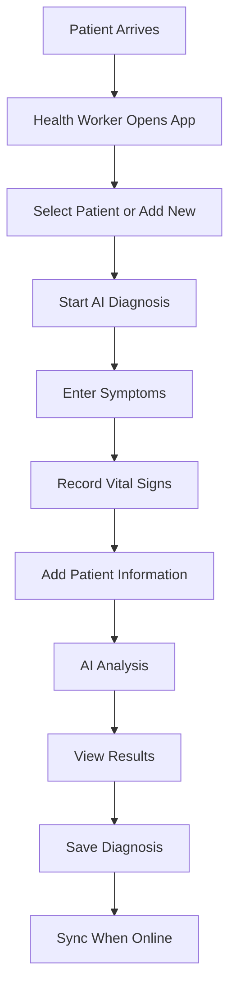
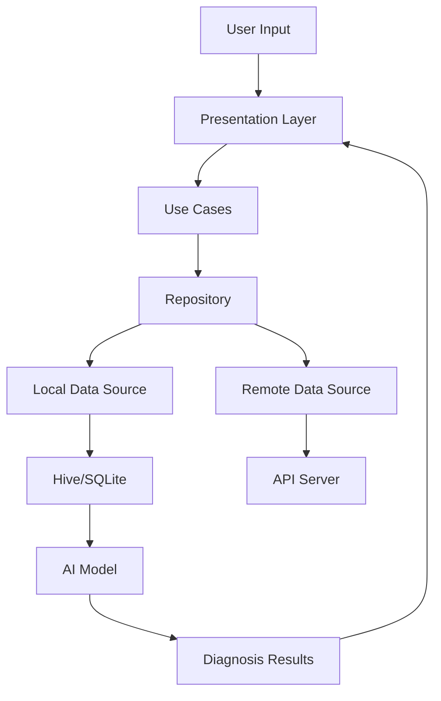

# AI Health Companion for Rural Clinics

<div align="center">
  
  
  <h3>Empowering Rural Healthcare with AI-Powered Disease Diagnosis</h3>
  
  <p>An offline-first mobile application designed to assist health workers in rural clinics with intelligent disease diagnosis, even in areas with poor or no internet connectivity.</p>
  
  [](https://flutter.dev/)
  [](https://dart.dev/)
  [](https://tensorflow.org/)
  [](#offline-first)
</div>

---

## 📋 Table of Contents

- [🎯 Overview](#-overview)
- [👥 Target Users](#-target-users)
- [🏥 How It Works](#-how-it-works)
- [📱 Key Features](#-key-features)
- [🚀 Getting Started](#-getting-started)
- [📖 User Guide](#-user-guide)
- [🔧 Technical Details](#-technical-details)
- [🏗️ System Architecture](#️-system-architecture)
- [📊 Data Flow](#-data-flow)
- [🔒 Security & Privacy](#-security--privacy)
- [🌐 Offline Capabilities](#-offline-capabilities)
- [🛠️ Development Setup](#️-development-setup)
- [📈 Future Enhancements](#-future-enhancements)
- [🤝 Contributing](#-contributing)
- [📄 License](#-license)

---

## 🎯 Overview

The **AI Health Companion for Rural Clinics** is a revolutionary mobile application that brings advanced AI-powered disease diagnosis to rural healthcare settings. Built with Flutter and designed for offline-first operation, this system empowers health workers with intelligent diagnostic assistance, even in areas with limited or no internet connectivity.

### 🌟 Mission
To bridge healthcare inequities between urban and rural communities by providing AI-powered diagnostic tools that work reliably in low-connectivity environments.

### 🎯 Goals
- **Reduce diagnostic errors** in rural healthcare settings
- **Support decision-making** for health workers with limited resources
- **Enable offline functionality** for areas with poor internet connectivity
- **Provide structured medical data** using FHIR/HL7 healthcare standards
- **Generate useful analytics** for health administrators

---

## 👥 Target Users

### 🩺 Primary Users
- **Rural Health Workers**: Nurses, community health workers, and medical assistants
- **Clinic Staff**: Administrative personnel managing patient records
- **Healthcare Administrators**: Supervisors monitoring clinic performance

### 🏥 Use Cases
- **Primary Care Clinics**: Basic diagnosis and patient management
- **Community Health Centers**: Outreach and mobile healthcare services
- **Rural Hospitals**: Supporting diagnostic decisions
- **Emergency Medical Services**: Quick assessment in remote areas

---

## 🏥 How It Works

### 🔄 Core Workflow



### 🧠 AI Diagnosis Process

1. **Symptom Collection**: Health worker selects relevant symptoms from categorized lists
2. **Vital Signs Input**: Records temperature, blood pressure, heart rate, etc.
3. **Patient Information**: Adds age, gender, weight, height, and medical history
4. **AI Analysis**: On-device AI model analyzes data and provides predictions
5. **Results Display**: Shows top 3 most likely diseases with confidence scores
6. **Recommendations**: Provides treatment suggestions and follow-up care

### 📊 Data Management

- **Local Storage**: All data stored securely on device using encrypted databases
- **Automatic Sync**: Data synchronizes with cloud servers when internet is available
- **Conflict Resolution**: Smart algorithms handle data conflicts during sync
- **Backup & Recovery**: Automatic backup ensures data safety

---

## 📱 Key Features

### 🧠 AI-Powered Diagnosis
- **On-Device AI**: TensorFlow Lite models for local disease prediction
- **Multi-Class Classification**: Predicts multiple possible conditions
- **Confidence Scoring**: Shows probability scores for each prediction
- **Symptom Analysis**: Comprehensive symptom categorization and analysis
- **Treatment Recommendations**: AI-suggested treatments and follow-up care

### 👥 Patient Management
- **Complete Patient Records**: Personal, medical, and contact information
- **Medical History Timeline**: Comprehensive health history tracking
- **Medication Management**: Current and historical medication records
- **Lab Results**: Integration with laboratory test results
- **Search & Filter**: Easy patient lookup and organization

### 📊 Analytics & Reporting
- **Diagnosis Statistics**: Track diagnosis patterns and trends
- **Patient Demographics**: Age, gender, and location analysis
- **Disease Distribution**: Visual representation of common conditions
- **Performance Metrics**: AI accuracy and response time tracking
- **Export Reports**: Generate and share diagnostic reports

### 🌐 Offline-First Design
- **No Internet Required**: Full functionality without connectivity
- **Local AI Models**: Disease prediction works offline
- **Data Persistence**: All information stored locally
- **Smart Sync**: Automatic synchronization when online
- **Conflict Resolution**: Handles data conflicts intelligently

### 🔒 Security & Privacy
- **End-to-End Encryption**: All data encrypted in transit and at rest
- **HIPAA Compliance**: Meets healthcare privacy standards
- **Role-Based Access**: Different permission levels for different users
- **Secure Authentication**: JWT-based secure login system
- **Data Anonymization**: Patient data protection features

---

## 🚀 Getting Started

### 📱 For End Users (Health Workers)

#### Installation
1. **Download the App**: Get the app from your clinic's IT administrator
2. **Install**: Follow the installation instructions for your device
3. **Login**: Use credentials provided by your clinic administrator
4. **Demo Mode**: Try the demo login to explore features

#### First Use
1. **Complete Setup**: Follow the initial setup wizard
2. **Add Patients**: Start by adding patient information
3. **Try Diagnosis**: Use the demo mode to practice AI diagnosis
4. **Explore Features**: Familiarize yourself with all app features

### 🛠️ For Administrators

#### System Requirements
- **Android**: Version 7.0 (API level 24) or higher
- **iOS**: Version 11.0 or higher
- **Storage**: Minimum 2GB free space
- **RAM**: 2GB minimum recommended

#### Initial Setup
1. **User Management**: Create accounts for health workers
2. **Role Assignment**: Assign appropriate permissions
3. **Data Configuration**: Set up clinic information
4. **Sync Settings**: Configure cloud synchronization

---

## 📖 User Guide

### 🏠 Home Dashboard

The home screen provides a comprehensive overview of your clinic's activity:

- **Quick Stats**: Total patients, diagnoses, success rate
- **Recent Activity**: Latest patient visits and diagnoses
- **Quick Actions**: Fast access to common tasks
- **Analytics Charts**: Visual representation of clinic performance

### 🧠 AI Diagnosis

#### Step 1: Select Symptoms
- Choose from categorized symptom lists
- Select all relevant symptoms
- Symptoms are organized by body systems

#### Step 2: Record Vital Signs
- Enter temperature, blood pressure, heart rate
- Record respiratory rate and oxygen saturation
- All measurements in standard medical units

#### Step 3: Patient Information
- Add age, gender, weight, height
- Include relevant medical history
- Note any allergies or current medications

#### Step 4: View Results
- See top 3 most likely diseases
- Review confidence scores
- Read treatment recommendations
- Save diagnosis to patient record

### 👥 Patient Management

#### Adding New Patients
1. **Personal Information**: Name, date of birth, gender, address
2. **Medical Information**: Weight, height, blood type, allergies
3. **Contact Information**: Phone, email, emergency contacts

#### Managing Patient Records
- **View Patient Details**: Complete patient information
- **Medical History**: Timeline of all visits and diagnoses
- **Edit Information**: Update patient details as needed
- **Search & Filter**: Find patients quickly

### 📊 Analytics Dashboard

#### Key Metrics
- **Total Patients**: Number of patients in system
- **Diagnoses**: Total AI diagnoses performed
- **Success Rate**: AI accuracy percentage
- **Average Time**: Time per diagnosis

#### Visualizations
- **Diagnosis Trends**: Line charts showing patterns over time
- **Disease Distribution**: Pie charts of common conditions
- **Patient Demographics**: Age and gender breakdowns
- **Performance Metrics**: AI accuracy and response times

### ⚙️ Settings & Configuration

#### App Settings
- **Notifications**: Enable/disable app notifications
- **Offline Mode**: Configure offline behavior
- **Auto Sync**: Set automatic synchronization preferences
- **Language**: Choose interface language
- **Theme**: Select light or dark mode

#### Data Management
- **Storage Usage**: Monitor app storage consumption
- **Backup Data**: Create manual backups
- **Restore Data**: Restore from backup files
- **Sync Status**: View synchronization status

---

## 🔧 Technical Details

### 🏗️ Technology Stack

#### Frontend (Mobile App)
- **Framework**: Flutter 3.7.2+
- **Language**: Dart
- **State Management**: Riverpod
- **Navigation**: GoRouter
- **UI Components**: Material Design 3

#### Local Storage
- **Primary Database**: Hive (NoSQL)
- **Secondary Database**: SQLite
- **Preferences**: SharedPreferences
- **File Storage**: Path Provider

#### AI & Machine Learning
- **Framework**: TensorFlow Lite
- **Model Format**: .tflite files
- **Inference**: On-device processing
- **Training**: External model training pipeline

#### Networking
- **HTTP Client**: Dio
- **API Communication**: RESTful APIs
- **Connectivity**: Connectivity Plus
- **Security**: HTTPS with certificate pinning

### 📱 Platform Support

| Platform | Version | Status |
|----------|---------|--------|
| Android | 7.0+ (API 24+) | ✅ Supported |
| iOS | 11.0+ | ✅ Supported |
| Web | Modern browsers | 🔄 Planned |
| Desktop | Windows/macOS/Linux | 🔄 Planned |

---

## 🏗️ System Architecture

### 🏛️ Clean Architecture

```
┌─────────────────────────────────────────────────────────────┐
│                    Presentation Layer                       │
│  ┌─────────────┐ ┌─────────────┐ ┌─────────────┐           │
│  │    Pages    │ │   Widgets   │ │  Providers  │           │
│  └─────────────┘ └─────────────┘ └─────────────┘           │
└─────────────────────────────────────────────────────────────┘
┌─────────────────────────────────────────────────────────────┐
│                     Domain Layer                            │
│  ┌─────────────┐ ┌─────────────┐ ┌─────────────┐           │
│  │  Use Cases  │ │  Entities   │ │ Interfaces  │           │
│  └─────────────┘ └─────────────┘ └─────────────┘           │
└─────────────────────────────────────────────────────────────┘
┌─────────────────────────────────────────────────────────────┐
│                      Data Layer                             │
│  ┌─────────────┐ ┌─────────────┐ ┌─────────────┐           │
│  │Repositories │ │ Data Sources │ │   Models    │           │
│  └─────────────┘ └─────────────┘ └─────────────┘           │
└─────────────────────────────────────────────────────────────┘
```

### 🔄 Data Flow Architecture



### 🧠 AI Model Architecture

```
Input Data → Preprocessing → Feature Extraction → AI Model → Postprocessing → Results
     ↓              ↓              ↓              ↓              ↓              ↓
  Symptoms      Normalization   Feature Vector   TensorFlow    Confidence    Disease
  Vitals        Encoding        Generation      Lite Model    Calculation   Predictions
  Patient Info  Validation      Selection       Inference     Ranking       Recommendations
```

---

## 📊 Data Flow

### 🔄 Synchronization Process

1. **Data Collection**: User inputs data locally
2. **Local Storage**: Data stored in encrypted local database
3. **Sync Queue**: Changes queued for synchronization
4. **Connectivity Check**: Monitor internet availability
5. **Batch Upload**: Send queued changes to server
6. **Conflict Resolution**: Handle data conflicts
7. **Confirmation**: Confirm successful sync

### 📱 Offline Data Management

- **Local Database**: All data stored locally using Hive
- **Sync Queue**: Pending changes tracked for later sync
- **Conflict Resolution**: Smart algorithms handle data conflicts
- **Data Integrity**: Checksums ensure data consistency
- **Recovery**: Automatic recovery from sync failures

---

## 🔒 Security & Privacy

### 🛡️ Data Protection

#### Encryption
- **At Rest**: AES-256 encryption for local data
- **In Transit**: TLS 1.3 for all network communication
- **Key Management**: Secure key storage and rotation
- **Certificate Pinning**: Prevent man-in-the-middle attacks

#### Authentication & Authorization
- **JWT Tokens**: Secure authentication tokens
- **Role-Based Access**: Different permission levels
- **Session Management**: Automatic token refresh
- **Multi-Factor Authentication**: Optional 2FA support

#### Privacy Compliance
- **HIPAA Compliance**: Healthcare privacy standards
- **GDPR Compliance**: European data protection
- **Data Minimization**: Collect only necessary data
- **Right to Deletion**: User data deletion capabilities

### 🔐 Security Features

- **Biometric Authentication**: Fingerprint/Face ID support
- **App Lock**: PIN/password protection
- **Secure Storage**: Encrypted local storage
- **Network Security**: Certificate pinning and validation
- **Audit Logging**: Track all data access and modifications

---

## 🌐 Offline Capabilities

### 📱 Offline-First Design

The app is designed to work seamlessly without internet connectivity:

#### ✅ Available Offline
- **AI Diagnosis**: Complete disease prediction
- **Patient Management**: View and edit patient records
- **Medical History**: Access complete patient timeline
- **Data Storage**: All information stored locally
- **Search & Filter**: Find patients and diagnoses
- **Reports**: Generate diagnostic reports

#### 🔄 Sync When Online
- **Automatic Sync**: Background synchronization
- **Manual Sync**: Force sync on demand
- **Conflict Resolution**: Handle data conflicts
- **Progress Tracking**: Monitor sync status
- **Error Handling**: Retry failed syncs

### 📊 Offline Data Management

```
Local Device                    Cloud Server
┌─────────────────┐           ┌─────────────────┐
│   Patient Data  │ ←────────→ │   Patient Data  │
│   Diagnoses     │           │   Diagnoses     │
│   AI Models     │           │   AI Models     │
│   Sync Queue    │           │   Analytics     │
└─────────────────┘           └─────────────────┘
```

---

## 🛠️ Development Setup

### 📋 Prerequisites

- **Flutter SDK**: 3.7.2 or higher
- **Dart SDK**: Included with Flutter
- **Android Studio**: For Android development
- **Xcode**: For iOS development (macOS only)
- **Git**: Version control
- **VS Code**: Recommended IDE

### 🚀 Installation

1. **Clone Repository**
   ```bash
   git clone https://github.com/your-org/ai-health-companion.git
   cd ai-health-companion
   ```

2. **Install Dependencies**
   ```bash
   flutter pub get
   ```

3. **Generate Code**
   ```bash
   flutter packages pub run build_runner build
   ```

4. **Run App**
   ```bash
   flutter run
   ```

### 🔧 Development Commands

```bash
# Run in debug mode
flutter run

# Run in release mode
flutter run --release

# Run tests
flutter test

# Build for Android
flutter build apk

# Build for iOS
flutter build ios

# Analyze code
flutter analyze

# Format code
flutter format .
```

### 📁 Project Structure

```
ai_health_companion/
├── lib/
│   ├── core/                 # Core functionality
│   │   ├── constants/       # App constants
│   │   ├── errors/          # Error handling
│   │   ├── network/         # Network config
│   │   ├── theme/           # App theme
│   │   └── utils/           # Utilities
│   ├── features/            # Feature modules
│   │   ├── auth/            # Authentication
│   │   ├── diagnosis/       # AI Diagnosis
│   │   ├── patient/         # Patient management
│   │   ├── analytics/       # Analytics
│   │   ├── settings/        # App settings
│   │   └── sync/            # Data sync
│   ├── shared/              # Shared components
│   │   ├── widgets/         # Reusable widgets
│   │   ├── services/        # Shared services
│   │   └── models/          # Data models
│   └── main.dart            # App entry point
├── assets/                  # App assets
│   ├── images/              # Images
│   ├── icons/               # App icons
│   ├── fonts/               # Custom fonts
│   └── models/              # AI models
├── test/                    # Test files
└── pubspec.yaml             # Dependencies
```

---

## 📈 Future Enhancements

### 🔮 Planned Features

#### Phase 2: Advanced AI
- **Voice Input**: Speech-to-text for symptom entry
- **Image Diagnostics**: Analyze medical images
- **Multi-Language Support**: Local language interfaces
- **Advanced Analytics**: Predictive health insights

#### Phase 3: Integration
- **EHR Integration**: Connect with existing systems
- **Lab Integration**: Direct lab result import
- **Pharmacy Integration**: Medication management
- **Telemedicine**: Video consultation support

#### Phase 4: Expansion
- **Multi-Clinic Support**: Manage multiple locations
- **Mobile Health**: Community health worker tools
- **Research Platform**: Contribute to medical research
- **AI Training**: Continuous model improvement

### 🌍 Global Expansion

- **Language Support**: English, Spanish, French, Swahili
- **Regional Adaptation**: Local disease patterns
- **Cultural Sensitivity**: Culturally appropriate interfaces
- **Regulatory Compliance**: Country-specific regulations

---

## 🤝 Contributing

We welcome contributions from developers, healthcare professionals, and researchers!

### 🛠️ For Developers

1. **Fork the Repository**
2. **Create Feature Branch**: `git checkout -b feature/amazing-feature`
3. **Make Changes**: Follow coding standards
4. **Add Tests**: Ensure code quality
5. **Submit Pull Request**: Describe your changes

### 🩺 For Healthcare Professionals

- **Feature Requests**: Suggest new functionality
- **User Testing**: Help test new features
- **Feedback**: Provide real-world usage feedback
- **Documentation**: Help improve user guides

### 🔬 For Researchers

- **Data Collaboration**: Contribute anonymized data
- **Model Improvement**: Help improve AI accuracy
- **Clinical Validation**: Validate diagnostic accuracy
- **Research Publications**: Collaborate on studies

### 📋 Contribution Guidelines

- **Code Style**: Follow Flutter/Dart conventions
- **Documentation**: Update docs for new features
- **Testing**: Add tests for new functionality
- **Security**: Ensure security best practices
- **Accessibility**: Make features accessible to all users

---

## 📄 License

This project is licensed under the **MIT License** - see the [LICENSE](LICENSE) file for details.

### 📜 License Summary

- ✅ **Commercial Use**: Use in commercial projects
- ✅ **Modification**: Modify and distribute
- ✅ **Distribution**: Share with others
- ✅ **Private Use**: Use in private projects
- ❌ **Liability**: No warranty provided
- ❌ **Warranty**: No warranty provided

---

## 📞 Support & Contact

### 🆘 Getting Help

- **Documentation**: Check this README and user guides
- **Issues**: Report bugs on GitHub Issues
- **Discussions**: Join community discussions
- **Email**: Contact support team directly

### 📧 Contact Information

- **Technical Support**: tech-support@ruralclinic.health
- **General Inquiries**: info@ruralclinic.health
- **Partnership**: partnerships@ruralclinic.health
- **Research Collaboration**: research@ruralclinic.health

### 🌐 Online Resources

- **Website**: [https://ruralclinic.health](https://ruralclinic.health)
- **Documentation**: [https://docs.ruralclinic.health](https://docs.ruralclinic.health)
- **Community Forum**: [https://community.ruralclinic.health](https://community.ruralclinic.health)
- **GitHub Repository**: [https://github.com/ruralclinic/ai-health-companion](https://github.com/ruralclinic/ai-health-companion)

---

<div align="center">
  <h3>🌟 Empowering Rural Healthcare with AI 🌟</h3>
  <p>Built with ❤️ for healthcare workers worldwide</p>
  
  <p>
    <a href="#-overview">Back to Top</a> •
    <a href="#-getting-started">Get Started</a> •
    <a href="#-contributing">Contribute</a> •
    <a href="#-support--contact">Support</a>
  </p>
</div>