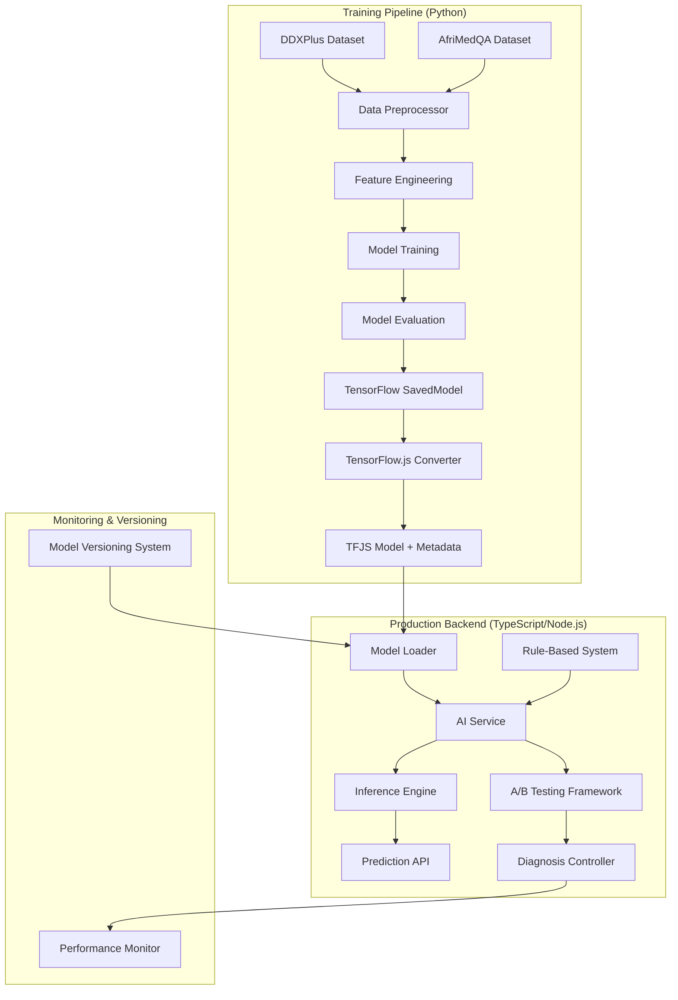

# Design Document: ML Model Training Integration

## Overview

This design document outlines the architecture and implementation strategy for upgrading the AI-Powered Community Health Companion system from a rule-based diagnosis system to a machine learning-based prediction system. The solution consists of two main components:

1. **Python Training Pipeline**: Preprocesses medical datasets (DDXPlus and AfriMedQA), trains a neural network model, evaluates performance, and exports the model in TensorFlow.js format
2. **TypeScript Integration Layer**: Loads the trained model into the existing Node.js backend, performs inference, and maintains backward compatibility with fallback mechanisms

### Key Design Principles

- **Offline-First**: All model inference must work without internet connectivity
- **Minimal Code Changes**: Integrate ML model into existing AI_Service with minimal disruption
- **Backward Compatibility**: Maintain existing API contracts and fallback to rule-based system
- **Performance**: Model size <50MB, inference time <2 seconds
- **Accuracy**: Target 90-95% accuracy on test set
- **Standards Compliance**: Maintain FHIR R4 and ICD-10 code support

### Technology Stack

- **Training**: Python 3.9+, TensorFlow 2.x, Pandas, NumPy, Scikit-learn
- **Deployment**: TensorFlow.js (Node.js), TypeScript, existing Node.js backend
- **Data**: DDXPlus dataset (1.3M cases, 49 diseases), AfriMedQA dataset
- **Storage**: Local file system for model artifacts, PostgreSQL for predictions


## Architecture

### High-Level Architecture



### Component Architecture

#### 1. Training Pipeline Components

**Data Preprocessor**
- Loads and validates DDXPlus and AfriMedQA datasets
- Handles missing values and data quality issues
- Merges datasets with consistent schema
- Splits data into train/validation/test sets (70/15/15)

**Feature Engineering Module**
- Converts symptoms to multi-hot encoding (binary vector per symptom category)
- Normalizes vital signs to [0, 1] range using min-max scaling
- Encodes demographics (age normalized, gender one-hot)
- Encodes medical history as binary features
- Produces fixed-size feature vectors compatible with neural network input

**Model Training Module**
- Implements feedforward neural network architecture
- Uses TensorFlow/Keras API for model definition
- Implements training loop with early stopping and checkpointing
- Applies regularization techniques (dropout, L2)
- Logs training metrics and hyperparameters

**Model Evaluation Module**
- Calculates accuracy, precision, recall, F1-score per disease
- Generates confusion matrix and classification report
- Measures inference time on sample batches
- Validates model size constraints
- Produces evaluation report with visualizations

**Model Export Module**
- Exports TensorFlow model in SavedModel format
- Converts to TensorFlow.js format using tensorflowjs_converter
- Generates metadata JSON with disease labels, feature specs, normalization params
- Validates converted model produces identical predictions
- Packages model artifacts for deployment

#### 2. Backend Integration Components

**Model Loader**
- Loads TFJS model from local file system on service initialization
- Parses metadata JSON for disease labels and preprocessing parameters
- Validates model compatibility with current schema
- Supports hot-reloading for model version updates
- Implements caching to avoid repeated loading

**Inference Engine**
- Converts DiagnosisInput to feature vector using same preprocessing as training
- Performs model inference using TensorFlow.js
- Applies confidence threshold filtering
- Maps output indices to disease names and ICD-10 codes
- Returns top-k predictions sorted by confidence

**Fallback Mechanism**
- Detects model loading failures and inference errors
- Automatically switches to rule-based system on failure
- Logs fallback events for monitoring
- Maintains consistent response format regardless of prediction source
- Includes metadata flag indicating prediction method used

**A/B Testing Framework**
- Generates both ML and rule-based predictions when enabled
- Implements configurable traffic splitting (e.g., 50% ML, 50% rule-based)
- Logs both prediction sets with request metadata for comparison
- Stores comparison data in database for analysis
- Provides API endpoints for A/B test results

**Model Versioning System**
- Organizes models in versioned directories (models/v1.0.0/, models/v1.1.0/)
- Maintains configuration file specifying active model version
- Validates new models before activation
- Supports rollback to previous versions
- Maintains changelog with version metadata

**Performance Monitor**
- Logs all predictions with timestamps and input features
- Tracks inference time per prediction
- Calculates rolling accuracy by comparing predictions to confirmed diagnoses
- Sends alerts when accuracy drops below threshold
- Provides metrics API endpoint for dashboards


## Components and Interfaces

### Training Pipeline Interfaces

#### DataPreprocessor

```python
class DataPreprocessor:
    """Handles loading and preprocessing of medical datasets."""
    
    def load_ddxplus(self, file_path: str) -> pd.DataFrame:
        """Load DDXPlus dataset from CSV/JSON."""
        pass
    
    def load_afrimedqa(self, file_path: str) -> pd.DataFrame:
        """Load AfriMedQA dataset from CSV/JSON."""
        pass
    
    def merge_datasets(self, ddxplus: pd.DataFrame, afrimedqa: pd.DataFrame) -> pd.DataFrame:
        """Merge datasets with consistent schema."""
        pass
    
    def handle_missing_values(self, df: pd.DataFrame) -> pd.DataFrame:
        """Impute missing values using median for vitals, zero for symptoms."""
        pass
    
    def split_data(self, df: pd.DataFrame, train_ratio: float = 0.7, 
                   val_ratio: float = 0.15) -> Tuple[pd.DataFrame, pd.DataFrame, pd.DataFrame]:
        """Split data into train, validation, and test sets."""
        pass
```

#### FeatureEngineer

```python
class FeatureEngineer:
    """Converts raw medical data to feature vectors."""
    
    def __init__(self, symptom_categories: List[str], vital_ranges: Dict[str, Tuple[float, float]]):
        self.symptom_categories = symptom_categories
        self.vital_ranges = vital_ranges
    
    def encode_symptoms(self, symptoms: List[Dict]) -> np.ndarray:
        """Convert symptoms to multi-hot encoding."""
        pass
    
    def normalize_vitals(self, vitals: Dict[str, float]) -> np.ndarray:
        """Normalize vital signs to [0, 1] range."""
        pass
    
    def encode_demographics(self, age: int, gender: str) -> np.ndarray:
        """Encode age (normalized) and gender (one-hot)."""
        pass
    
    def encode_medical_history(self, history: List[str]) -> np.ndarray:
        """Encode medical history as binary features."""
        pass
    
    def create_feature_vector(self, patient_data: Dict) -> np.ndarray:
        """Create complete feature vector from patient data."""
        pass
    
    def get_feature_specs(self) -> Dict:
        """Return feature specifications for metadata."""
        pass
```

#### ModelTrainer

```python
class ModelTrainer:
    """Trains neural network model for disease prediction."""
    
    def __init__(self, input_dim: int, num_classes: int, config: Dict):
        self.input_dim = input_dim
        self.num_classes = num_classes
        self.config = config
    
    def build_model(self) -> tf.keras.Model:
        """Build feedforward neural network architecture."""
        pass
    
    def train(self, X_train: np.ndarray, y_train: np.ndarray,
              X_val: np.ndarray, y_val: np.ndarray) -> tf.keras.callbacks.History:
        """Train model with early stopping and checkpointing."""
        pass
    
    def save_model(self, path: str) -> None:
        """Save model in TensorFlow SavedModel format."""
        pass
```

#### ModelEvaluator

```python
class ModelEvaluator:
    """Evaluates trained model performance."""
    
    def evaluate(self, model: tf.keras.Model, X_test: np.ndarray, 
                 y_test: np.ndarray, disease_labels: List[str]) -> Dict:
        """Calculate accuracy, precision, recall, F1-score."""
        pass
    
    def generate_confusion_matrix(self, y_true: np.ndarray, y_pred: np.ndarray) -> np.ndarray:
        """Generate confusion matrix."""
        pass
    
    def measure_inference_time(self, model: tf.keras.Model, X_sample: np.ndarray) -> float:
        """Measure average inference time."""
        pass
    
    def check_model_size(self, model_path: str) -> float:
        """Check model size in MB."""
        pass
    
    def generate_report(self, metrics: Dict, output_path: str) -> None:
        """Generate evaluation report with visualizations."""
        pass
```

#### ModelConverter

```python
class ModelConverter:
    """Converts TensorFlow model to TensorFlow.js format."""
    
    def convert_to_tfjs(self, saved_model_path: str, output_path: str) -> None:
        """Convert SavedModel to TFJS format using tensorflowjs_converter."""
        pass
    
    def validate_conversion(self, tf_model: tf.keras.Model, tfjs_model_path: str,
                           X_sample: np.ndarray) -> bool:
        """Validate TFJS model produces identical predictions."""
        pass
    
    def generate_metadata(self, disease_labels: List[str], feature_specs: Dict,
                         normalization_params: Dict, output_path: str) -> None:
        """Generate metadata JSON file."""
        pass
```


### Backend Integration Interfaces

#### ModelLoader (TypeScript)

```typescript
interface ModelMetadata {
    version: string;
    diseaseLabels: string[];
    icd10Codes: Record<string, string>;
    featureSpecs: {
        symptomCategories: string[];
        vitalRanges: Record<string, { min: number; max: number }>;
        inputDim: number;
    };
    normalizationParams: Record<string, any>;
    trainingDate: string;
    accuracy: number;
}

class ModelLoader {
    private model: tf.GraphModel | null = null;
    private metadata: ModelMetadata | null = null;
    
    async loadModel(modelPath: string): Promise<void>;
    async loadMetadata(metadataPath: string): Promise<void>;
    getModel(): tf.GraphModel;
    getMetadata(): ModelMetadata;
    async reloadModel(modelPath: string): Promise<void>;
}
```

#### InferenceEngine (TypeScript)

```typescript
interface FeatureVector {
    symptoms: number[];
    vitals: number[];
    demographics: number[];
    medicalHistory: number[];
}

class InferenceEngine {
    constructor(private model: tf.GraphModel, private metadata: ModelMetadata);
    
    preprocessInput(input: DiagnosisInput): FeatureVector;
    encodeSymptoms(symptoms: Array<{ name: string; category: string }>): number[];
    normalizeVitals(vitals: IVitalSigns): number[];
    encodeDemographics(age: number, gender: string): number[];
    encodeMedicalHistory(history: string[]): number[];
    
    async predict(input: DiagnosisInput): Promise<Prediction[]>;
    async runInference(featureVector: FeatureVector): Promise<number[]>;
    filterByConfidence(predictions: number[], threshold: number): Prediction[];
    mapToDiseases(predictions: number[]): Prediction[];
}
```

#### FallbackMechanism (TypeScript)

```typescript
interface PredictionResult {
    predictions: Prediction[];
    method: 'ml' | 'rule-based';
    fallbackReason?: string;
}

class FallbackMechanism {
    constructor(
        private mlPredictor: InferenceEngine,
        private ruleBasedPredictor: RuleBasedPredictor
    );
    
    async predict(input: DiagnosisInput): Promise<PredictionResult>;
    private async tryMLPrediction(input: DiagnosisInput): Promise<Prediction[] | null>;
    private async fallbackToRuleBased(input: DiagnosisInput, error: Error): Promise<Prediction[]>;
    private logFallback(error: Error, input: DiagnosisInput): void;
}
```

#### ABTestingFramework (TypeScript)

```typescript
interface ABTestConfig {
    enabled: boolean;
    mlTrafficPercentage: number;
    logComparisons: boolean;
}

interface ABTestResult {
    requestId: string;
    mlPredictions: Prediction[];
    ruleBasedPredictions: Prediction[];
    selectedMethod: 'ml' | 'rule-based';
    timestamp: Date;
}

class ABTestingFramework {
    constructor(
        private mlPredictor: InferenceEngine,
        private ruleBasedPredictor: RuleBasedPredictor,
        private config: ABTestConfig
    );
    
    async predict(input: DiagnosisInput): Promise<PredictionResult>;
    private async generateBothPredictions(input: DiagnosisInput): Promise<ABTestResult>;
    private selectPredictionMethod(): 'ml' | 'rule-based';
    private async logComparison(result: ABTestResult): Promise<void>;
    async getABTestResults(startDate: Date, endDate: Date): Promise<ABTestResult[]>;
}
```

#### ModelVersioningSystem (TypeScript)

```typescript
interface ModelVersion {
    version: string;
    path: string;
    accuracy: number;
    deployedAt: Date;
    isActive: boolean;
}

class ModelVersioningSystem {
    private versions: ModelVersion[] = [];
    private activeVersion: string;
    
    async listVersions(): Promise<ModelVersion[]>;
    async getActiveVersion(): Promise<ModelVersion>;
    async validateModel(modelPath: string): Promise<boolean>;
    async activateVersion(version: string): Promise<void>;
    async rollbackToPreviousVersion(): Promise<void>;
    async addVersion(version: ModelVersion): Promise<void>;
    private async updateConfig(version: string): Promise<void>;
}
```

#### PerformanceMonitor (TypeScript)

```typescript
interface PredictionLog {
    id: string;
    timestamp: Date;
    input: DiagnosisInput;
    predictions: Prediction[];
    method: 'ml' | 'rule-based';
    inferenceTime: number;
}

interface PerformanceMetrics {
    totalPredictions: number;
    mlPredictions: number;
    ruleBasedPredictions: number;
    averageInferenceTime: number;
    rollingAccuracy: number;
    accuracyByDisease: Record<string, number>;
}

class PerformanceMonitor {
    async logPrediction(log: PredictionLog): Promise<void>;
    async logConfirmedDiagnosis(predictionId: string, confirmedDisease: string): Promise<void>;
    async calculateRollingAccuracy(windowDays: number): Promise<number>;
    async getMetrics(startDate: Date, endDate: Date): Promise<PerformanceMetrics>;
    async checkAccuracyThreshold(threshold: number): Promise<boolean>;
    private async sendAlert(message: string): Promise<void>;
}
```


## Data Models

### Training Data Schema

```python
# Patient record schema for training
PatientRecord = {
    'patient_id': str,
    'age': int,
    'gender': str,  # 'male', 'female', 'other'
    'symptoms': List[{
        'name': str,
        'category': str,  # 'respiratory', 'digestive', 'neurological', etc.
        'severity': str,  # 'mild', 'moderate', 'severe'
        'duration': str
    }],
    'vital_signs': {
        'temperature': float,  # Celsius
        'blood_pressure_systolic': int,  # mmHg
        'blood_pressure_diastolic': int,  # mmHg
        'heart_rate': int,  # bpm
        'respiratory_rate': int,  # breaths/min
        'oxygen_saturation': float  # percentage
    },
    'medical_history': List[str],  # chronic conditions, allergies
    'diagnosis': str,  # ground truth disease label
    'icd10_code': str
}
```

### Feature Vector Schema

```python
# Feature vector structure (fixed size)
FeatureVector = {
    # Vital signs (6 features, normalized to [0, 1])
    'temperature_norm': float,
    'bp_systolic_norm': float,
    'bp_diastolic_norm': float,
    'heart_rate_norm': float,
    'respiratory_rate_norm': float,
    'oxygen_saturation_norm': float,
    
    # Demographics (3 features)
    'age_norm': float,  # normalized to [0, 1]
    'gender_male': int,  # 0 or 1
    'gender_female': int,  # 0 or 1
    
    # Symptoms (multi-hot encoding, ~50-100 features depending on symptom categories)
    'symptom_respiratory': int,  # 0 or 1
    'symptom_digestive': int,
    'symptom_neurological': int,
    'symptom_cardiovascular': int,
    'symptom_general': int,
    # ... additional symptom categories
    
    # Medical history (binary features, ~20-30 features)
    'history_diabetes': int,
    'history_hypertension': int,
    'history_asthma': int,
    # ... additional conditions
}

# Total feature vector size: ~80-140 features
```

### Model Output Schema

```python
# Model output (probability distribution over diseases)
ModelOutput = {
    'probabilities': np.ndarray,  # shape: (num_diseases,), values in [0, 1], sum to 1
    'disease_indices': List[int],  # indices of diseases sorted by probability
    'top_k_predictions': List[{
        'disease': str,
        'confidence': float,
        'icd10_code': str
    }]
}
```

### Metadata File Schema

```json
{
    "version": "1.0.0",
    "trainingDate": "2024-01-15T10:30:00Z",
    "accuracy": 0.92,
    "diseaseLabels": [
        "Common Cold",
        "Influenza",
        "Malaria",
        "..."
    ],
    "icd10Codes": {
        "Common Cold": "J00",
        "Influenza": "J11",
        "Malaria": "B54",
        "...": "..."
    },
    "featureSpecs": {
        "inputDim": 120,
        "symptomCategories": [
            "respiratory",
            "digestive",
            "neurological",
            "cardiovascular",
            "general",
            "..."
        ],
        "vitalRanges": {
            "temperature": {"min": 35.0, "max": 42.0},
            "bloodPressureSystolic": {"min": 80, "max": 200},
            "bloodPressureDiastolic": {"min": 50, "max": 120},
            "heartRate": {"min": 40, "max": 180},
            "respiratoryRate": {"min": 10, "max": 40},
            "oxygenSaturation": {"min": 80, "max": 100}
        }
    },
    "normalizationParams": {
        "ageRange": {"min": 0, "max": 100}
    },
    "modelArchitecture": {
        "layers": [
            {"type": "dense", "units": 256, "activation": "relu"},
            {"type": "dropout", "rate": 0.3},
            {"type": "dense", "units": 128, "activation": "relu"},
            {"type": "dropout", "rate": 0.2},
            {"type": "dense", "units": 64, "activation": "relu"},
            {"type": "dense", "units": 49, "activation": "softmax"}
        ]
    },
    "trainingConfig": {
        "batchSize": 32,
        "epochs": 100,
        "learningRate": 0.001,
        "optimizer": "adam",
        "loss": "categorical_crossentropy"
    }
}
```

### Database Schema Extensions

```typescript
// Extension to existing Diagnosis model
interface DiagnosisPredictionMetadata {
    modelVersion: string;
    predictionMethod: 'ml' | 'rule-based';
    inferenceTime: number;  // milliseconds
    confidenceScores: Record<string, number>;
    fallbackReason?: string;
}

// New table for A/B testing results
interface ABTestLog {
    id: string;
    diagnosisId: string;
    timestamp: Date;
    mlPredictions: Prediction[];
    ruleBasedPredictions: Prediction[];
    selectedMethod: 'ml' | 'rule-based';
    patientAge: number;
    patientGender: string;
}

// New table for performance tracking
interface PredictionAccuracyLog {
    id: string;
    diagnosisId: string;
    predictedDisease: string;
    predictedConfidence: number;
    confirmedDisease?: string;
    isCorrect?: boolean;
    timestamp: Date;
    modelVersion: string;
}
```


## Correctness Properties

*A property is a characteristic or behavior that should hold true across all valid executions of a system—essentially, a formal statement about what the system should do. Properties serve as the bridge between human-readable specifications and machine-verifiable correctness guarantees.*

### Training Pipeline Properties

**Property 1: Data preprocessing produces valid feature vectors**
*For any* valid patient record from DDXPlus or AfriMedQA datasets, preprocessing should produce a feature vector with all values in valid ranges (normalized values in [0, 1], binary values in {0, 1}) and correct dimensionality.
**Validates: Requirements 1.1, 1.2, 2.1, 2.2, 2.3, 2.4, 2.6**

**Property 2: Data split maintains proportions and no overlap**
*For any* dataset, splitting into train/validation/test sets should produce three non-overlapping sets with proportions within 1% of target ratios (70/15/15) and total size equal to original dataset.
**Validates: Requirements 1.3**

**Property 3: Missing value imputation is consistent**
*For any* patient record with missing values, imputation should use median for vital signs and zero-fill for symptoms, and the result should have no missing values.
**Validates: Requirements 2.5**

**Property 4: Model export produces loadable artifacts**
*For any* trained model, exporting to SavedModel format should produce files that can be reloaded and produce identical predictions on sample inputs.
**Validates: Requirements 1.5**

**Property 5: Metadata generation is complete**
*For any* model export, the generated metadata file should contain all required fields (disease labels, ICD-10 codes, feature specs, normalization params, model version) with valid values.
**Validates: Requirements 1.6, 5.5**

**Property 6: Model output is valid probability distribution**
*For any* input to the trained model, the output should be a valid probability distribution (all values in [0, 1], sum equals 1.0 within floating-point tolerance).
**Validates: Requirements 3.2**

**Property 7: Model size constraint is satisfied**
*For any* exported TensorFlow or TFJS model, the total size of all model files should be less than 50MB.
**Validates: Requirements 3.6, 5.4**

**Property 8: Inference time meets performance requirement**
*For any* input to the model, inference time should be less than 2 seconds measured from input preprocessing to output generation.
**Validates: Requirements 3.8**

**Property 9: Evaluation metrics are calculated correctly**
*For any* set of predictions and ground truth labels, evaluation should calculate accuracy, precision, recall, and F1-score for each disease class, and all metrics should be in [0, 1] range.
**Validates: Requirements 4.1, 4.2, 4.3, 4.4, 4.5**

**Property 10: Low accuracy triggers warnings**
*For any* model with test accuracy below 90%, the evaluation pipeline should log warnings recommending retraining.
**Validates: Requirements 4.6**

**Property 11: TensorFlow.js conversion preserves predictions (Round-trip)**
*For any* input sample, predictions from the original TensorFlow model and the converted TFJS model should be identical (within floating-point tolerance of 1e-5).
**Validates: Requirements 5.3**

**Property 12: TFJS conversion produces required files**
*For any* model conversion, the output directory should contain model.json and at least one binary weight file (.bin).
**Validates: Requirements 5.2**

**Property 13: ICD-10 mapping is complete**
*For any* disease label in the training data, there should be a corresponding valid ICD-10 code in the metadata.
**Validates: Requirements 12.1, 12.5**


### Backend Integration Properties

**Property 14: Feature vector preprocessing is consistent with training**
*For any* DiagnosisInput, the feature vector produced by the AI_Service should match the format and normalization used during training (same dimensions, same value ranges).
**Validates: Requirements 6.3**

**Property 15: Inference pipeline produces valid predictions**
*For any* valid DiagnosisInput, the inference pipeline should return predictions with confidence scores in [0, 1], sorted by confidence descending, limited to top 5, and each including disease name, ICD-10 code, and recommendations.
**Validates: Requirements 6.4, 6.5, 6.6, 6.7**

**Property 16: Confidence threshold filtering works correctly**
*For any* set of predictions and confidence threshold, filtered predictions should only include those with confidence >= threshold, and all filtered predictions should be above threshold.
**Validates: Requirements 6.5**

**Property 17: Fallback mechanism activates on errors**
*For any* inference error or model loading failure, the AI_Service should catch the error, activate the rule-based fallback, log the fallback event, and return predictions in the same format as ML predictions.
**Validates: Requirements 7.2, 7.3, 7.4**

**Property 18: Prediction method flag is always present**
*For any* prediction response (ML or rule-based), the response should include a method flag indicating which prediction system was used.
**Validates: Requirements 7.5**

**Property 19: A/B testing generates both prediction types**
*For any* request when A/B testing is enabled, the system should generate both ML and rule-based predictions, log both with metadata, and return one based on the configured split ratio.
**Validates: Requirements 8.1, 8.2, 8.3, 8.4**

**Property 20: A/B testing stores comparison data**
*For any* A/B test execution, comparison data including both prediction sets, confidence scores, and prediction differences should be stored for analysis.
**Validates: Requirements 8.5**

**Property 21: Model validation before activation**
*For any* new model version, the versioning system should validate the model (check size, test inference, verify metadata) before allowing activation.
**Validates: Requirements 9.3**

**Property 22: Model version update triggers reload**
*For any* change to the active model version in configuration, the AI_Service should reload the new model and subsequent predictions should use the new version.
**Validates: Requirements 9.4, 9.5**

**Property 23: Changelog is maintained for version changes**
*For any* model version activation, the changelog should be updated with version number, accuracy metrics, and deployment timestamp.
**Validates: Requirements 9.6**

**Property 24: Prediction logging is complete**
*For any* prediction made by the AI_Service, a log entry should be created containing timestamp, input features, output predictions, method used, and inference time.
**Validates: Requirements 10.1**

**Property 25: Confirmed diagnosis logging**
*For any* diagnosis confirmed by a healthcare provider, the Diagnosis_Controller should log the confirmation with the original prediction ID for accuracy tracking.
**Validates: Requirements 10.2**

**Property 26: Rolling accuracy calculation is correct**
*For any* set of predictions with confirmed diagnoses, rolling accuracy should be calculated as (number of correct predictions) / (total predictions) and should be in [0, 1] range.
**Validates: Requirements 10.3**

**Property 27: Accuracy alerts trigger at threshold**
*For any* rolling accuracy calculation that drops below 85%, an alert should be sent to administrators.
**Validates: Requirements 10.4**

**Property 28: Inference time tracking and warnings**
*For any* prediction, inference time should be tracked, and if it exceeds 2 seconds, a warning should be logged.
**Validates: Requirements 10.5**

**Property 29: Offline model loading (no network requests)**
*For any* AI_Service initialization, the model should be loaded from local file system without making any network requests.
**Validates: Requirements 11.2, 11.3**

**Property 30: FHIR R4 compliance in predictions**
*For any* diagnosis data returned by the AI_Service, the format should comply with FHIR R4 Condition resource structure including required fields (code, subject, recordedDate).
**Validates: Requirements 12.3**

**Property 31: Training reproducibility through logging**
*For any* training run, all hyperparameters, random seeds, and configuration should be logged to enable exact reproduction of results.
**Validates: Requirements 13.4**

**Property 32: Training history is saved**
*For any* completed training run, training history including loss and accuracy curves for each epoch should be saved to disk.
**Validates: Requirements 13.5**


## Error Handling

### Training Pipeline Error Handling

**Data Loading Errors**
- Invalid file format: Log error with file path and expected format, exit with code 1
- Missing required columns: Log missing columns, provide schema documentation, exit with code 1
- Corrupted data: Log row numbers with issues, skip corrupted rows, log warning if >5% skipped

**Preprocessing Errors**
- Invalid vital sign values: Log warning, apply median imputation
- Unknown symptom categories: Log warning, skip unknown symptoms
- Missing required fields: Log error with record ID, skip record, continue processing

**Training Errors**
- Out of memory: Log error, suggest reducing batch size, exit with code 1
- Model divergence (loss = NaN): Log error, suggest reducing learning rate, exit with code 1
- Low accuracy (<90%): Log warning, save model anyway, recommend hyperparameter tuning

**Export Errors**
- Failed to save model: Log error with path and permissions, retry once, exit with code 1
- Conversion failure: Log error with TensorFlow.js converter output, exit with code 1
- Metadata generation failure: Log error, create minimal metadata, log warning

### Backend Integration Error Handling

**Model Loading Errors**
- Model file not found: Log error, activate fallback mechanism, continue with rule-based
- Invalid model format: Log error, activate fallback mechanism, send alert to admins
- Metadata parsing error: Log error, use default metadata, log warning

**Inference Errors**
- Invalid input format: Return 400 Bad Request with validation errors
- Model inference exception: Log error, use fallback mechanism, return rule-based predictions
- Timeout (>2 seconds): Log warning, return partial results or fallback

**Fallback Mechanism Errors**
- Both ML and rule-based fail: Log critical error, return 500 Internal Server Error with message
- Fallback logging failure: Log to stderr, continue with prediction

**A/B Testing Errors**
- Failed to generate one prediction type: Log error, return the successful prediction type
- Logging failure: Log to stderr, continue with prediction, don't block user request

**Versioning Errors**
- Invalid model version: Log error, continue with current version, send alert
- Validation failure: Log error, reject activation, keep current version active
- Rollback failure: Log critical error, attempt emergency fallback to rule-based

**Monitoring Errors**
- Database logging failure: Log to file system, queue for retry
- Alert sending failure: Log error, retry with exponential backoff (max 3 attempts)
- Metrics calculation error: Log error, return cached metrics or empty response

### Error Recovery Strategies

**Graceful Degradation**
- ML model unavailable → Use rule-based system
- Partial data available → Make prediction with available features, log warning
- Slow inference → Return cached predictions if available, log warning

**Retry Logic**
- Model loading: Retry once after 5 seconds
- Database operations: Retry 3 times with exponential backoff
- Alert sending: Retry 3 times with exponential backoff

**Circuit Breaker Pattern**
- If ML inference fails >10 times in 1 minute → Switch to rule-based for 5 minutes
- If database logging fails >20 times in 1 minute → Switch to file logging for 10 minutes
- Reset circuit breaker after successful operations


## Testing Strategy

### Dual Testing Approach

This project requires both **unit tests** and **property-based tests** for comprehensive coverage:

- **Unit tests**: Verify specific examples, edge cases, error conditions, and integration points
- **Property-based tests**: Verify universal properties across randomized inputs (minimum 100 iterations per test)

Both testing approaches are complementary and necessary. Unit tests catch concrete bugs in specific scenarios, while property-based tests verify general correctness across a wide input space.

### Property-Based Testing Configuration

**Library Selection:**
- **Python (Training Pipeline)**: Use `hypothesis` library for property-based testing
- **TypeScript (Backend)**: Use `fast-check` library for property-based testing

**Test Configuration:**
- Minimum 100 iterations per property test (due to randomization)
- Each property test must reference its design document property
- Tag format: `Feature: ml-model-training-integration, Property {number}: {property_text}`

**Example Property Test (Python):**
```python
from hypothesis import given, strategies as st
import numpy as np

@given(
    temperature=st.floats(min_value=35.0, max_value=42.0),
    bp_systolic=st.integers(min_value=80, max_value=200),
    bp_diastolic=st.integers(min_value=50, max_value=120)
)
def test_vital_normalization_in_range(temperature, bp_systolic, bp_diastolic):
    """
    Feature: ml-model-training-integration
    Property 1: Data preprocessing produces valid feature vectors
    
    For any valid vital signs, normalization should produce values in [0, 1] range.
    """
    vitals = {
        'temperature': temperature,
        'bloodPressureSystolic': bp_systolic,
        'bloodPressureDiastolic': bp_diastolic
    }
    
    normalized = feature_engineer.normalize_vitals(vitals)
    
    assert all(0.0 <= val <= 1.0 for val in normalized), \
        f"Normalized values out of range: {normalized}"
```

**Example Property Test (TypeScript):**
```typescript
import fc from 'fast-check';

describe('Feature: ml-model-training-integration', () => {
  it('Property 15: Inference pipeline produces valid predictions', () => {
    fc.assert(
      fc.property(
        fc.record({
          symptoms: fc.array(fc.record({
            name: fc.string(),
            category: fc.constantFrom('respiratory', 'digestive', 'neurological')
          })),
          vitalSigns: fc.record({
            temperature: fc.float({ min: 35, max: 42 }),
            heartRate: fc.integer({ min: 40, max: 180 })
          }),
          age: fc.integer({ min: 0, max: 100 }),
          gender: fc.constantFrom('male', 'female', 'other')
        }),
        async (input) => {
          const predictions = await inferenceEngine.predict(input);
          
          // All predictions should have confidence in [0, 1]
          predictions.forEach(p => {
            expect(p.confidence).toBeGreaterThanOrEqual(0);
            expect(p.confidence).toBeLessThanOrEqual(1);
          });
          
          // Should be sorted by confidence descending
          for (let i = 0; i < predictions.length - 1; i++) {
            expect(predictions[i].confidence).toBeGreaterThanOrEqual(
              predictions[i + 1].confidence
            );
          }
          
          // Should be limited to top 5
          expect(predictions.length).toBeLessThanOrEqual(5);
          
          // Each should have required fields
          predictions.forEach(p => {
            expect(p.disease).toBeDefined();
            expect(p.icd10Code).toBeDefined();
            expect(p.recommendations).toBeDefined();
          });
        }
      ),
      { numRuns: 100 }
    );
  });
});
```

### Unit Testing Strategy

**Training Pipeline Unit Tests:**
- Test data loading with sample CSV files
- Test preprocessing with known input/output pairs
- Test model architecture construction
- Test evaluation metrics calculation with known confusion matrices
- Test model export and conversion with sample models
- Test error handling with invalid inputs

**Backend Integration Unit Tests:**
- Test model loading with mock model files
- Test API endpoints with sample requests
- Test fallback mechanism activation
- Test A/B testing traffic splitting
- Test model versioning operations
- Test monitoring and logging
- Test FHIR R4 format compliance

**Integration Tests:**
- End-to-end test: Load model → Make prediction → Verify response format
- Test model update workflow: Deploy new version → Verify reload → Test predictions
- Test A/B testing workflow: Enable A/B → Make requests → Verify logging
- Test fallback workflow: Simulate ML failure → Verify rule-based activation
- Test monitoring workflow: Make predictions → Confirm diagnoses → Verify accuracy calculation

### Test Data Strategy

**Training Pipeline:**
- Use subset of DDXPlus dataset (1000 samples) for unit tests
- Generate synthetic patient records for property tests
- Include edge cases: missing values, extreme vital signs, rare diseases

**Backend Integration:**
- Mock TFJS model for fast unit tests
- Use small real model (<1MB) for integration tests
- Generate random DiagnosisInput for property tests
- Include edge cases: empty symptoms, missing vitals, unknown diseases

### Test Coverage Goals

- **Line coverage**: >80% for all code
- **Branch coverage**: >75% for all conditional logic
- **Property coverage**: 100% of correctness properties tested
- **Integration coverage**: All major workflows tested end-to-end

### Continuous Testing

- Run unit tests on every commit (fast feedback)
- Run property tests on every pull request (comprehensive validation)
- Run integration tests before deployment (system validation)
- Run performance tests weekly (regression detection)

